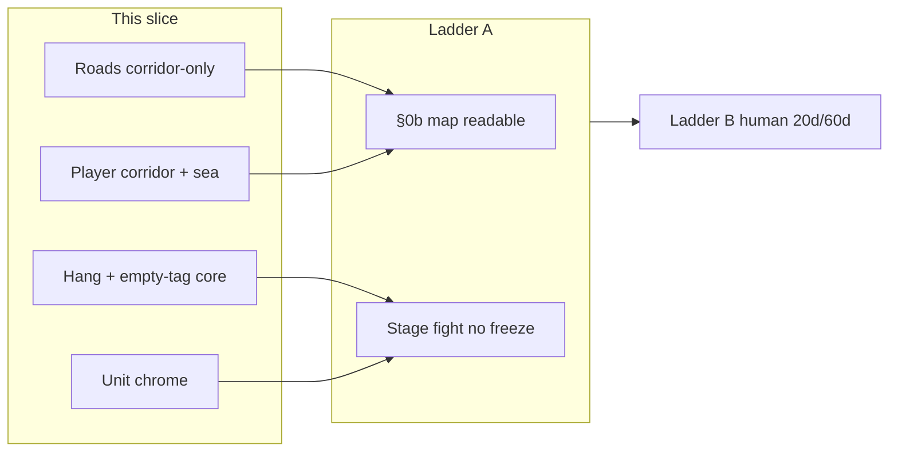
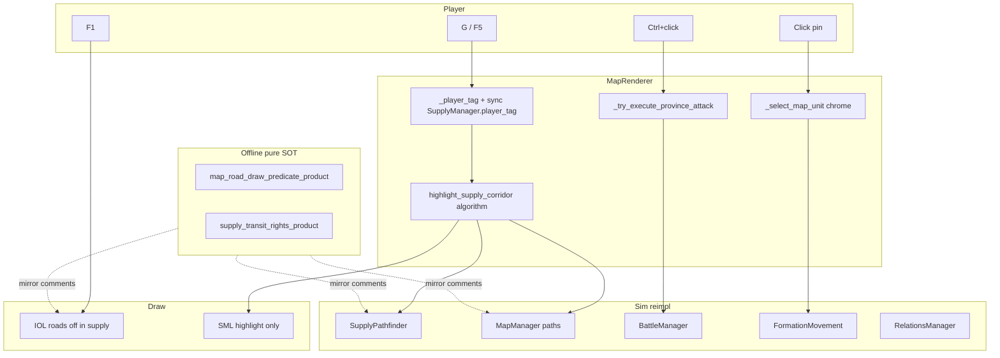

# EOA Next Engineering Slice — Play Blockers → Ladder A

| Field | Value |
|-------|-------|
| **Document** | Next implementable engineering program (play blockers → shippable PRs) |
| **Author** | Grok Design (systems) |
| **Date** | 2026-08-11 |
| **Status** | Draft (rev 2 — review issues 1–15 addressed) |
| **Board** | `world_accurate` ~3520 (default F5) |
| **Engine** | Godot **4.7.1** via `tools/run_godot.sh` |
| **Truth sources** | `docs/GAME_STATUS_SNAPSHOT.md`, `docs/EOA_RESIDUAL_PRIORITY_BOARD.md`, `docs/PLAYTEST_AND_DECISION_GUIDE.md`, `docs/SESSION_NOTES/2026-08-05_m6_smoke.md`, skill `eoa-full-test` |

---

## Overview

Machine full-test is green (HOI open P0 = 0; gates `tools/eoa_full_test_gates.sh`). Human campaign feel is not. Code already contains **partial** corridor-only roads, transit-filtered BFS, and assault hang guards — but implementer-facing bugs remain: G corridor tags the **front owner** not the player, empty `owner_tag` skips land filters on MapManager BFS, sea is not re-attempted after land failure, and capture light-refresh still full-boards ~3520 fills + all unit pins.

This design defines a **focused next slice** (4–6 PRs): unbreak hang + map readability first (with early empty-tag honesty), then correct supply pathing (player-tag corridor + explicit sea step + real exclave fixture), then minimal pin select→move→assault polish. Pure products under `tools/map_generation/lib/` are **offline source-of-truth for rules** (Godot reimplements; no Python at runtime). No dual spam, densify re-opens, or soft-30fps invention.

---

## Background & Motivation

### Current machine truth (do not re-prove)

- Default board: Europe NUTS ~1514 + US playable 130 + RoW sparse ~1536 + seas 340 ≈ **3520**.
- Dual scaffold `EOA_SCENARIO=world_full` (~2665) — **never renumber IDs**.
- Map machine closed (M0–M5, A2/A2b, Fronts, WarLoop surface, unit counter LOD, Command Center save).
- Soft map-tick proxy ~29.4 fps remains **honest FAIL** — not this slice’s gate.
- M6 human 20d/60d narrative notes remain **human-only** (not PR work).

### Play blockers (code residual + partial human session)

Evidence mix: **code comments + partial landings that still fail paths**, plus human session notes (`docs/SESSION_NOTES/2026-08-05_m6_smoke.md` — B hang fixed; §0b items 10–12 not fully written). Residual board (2026-08-03) does **not** list these five; treat as **post-session code residuals**, not as “session fully failed all five.”

| # | Blocker | Evidence pointer | Severity |
|---|---------|------------------|----------|
| 1 | **G / F5 road spiderweb** | `InfrastructureOverlayLayer.rebuild_road_layer` corridor intent vs `SupplyMapLayer` bulk `_routes_to_draw` + `_refresh_supply_routes` still `set_routes(get_all_routes())`; play reports dense yellow/lime blink | P0 visual |
| 2 | **F1 residual roads/rails** | `set_show_roads(false)` wipes children; `set_show_rails(false)` only hides visibility | P0 visual |
| 3 | **Supply path / transit honesty** | `SupplyPathfinder._is_friendly` empty tag → true; `MapManager.find_land_path` **skips filter** when tag empty; G uses **selected owner** not player; land fail toasts without forced sea step | P0 sim |
| 4 | **Second Ctrl+click hang** | `_try_execute_province_attack` still deferred `show_info_panel`; `refresh_after_capture_light` → `_refresh_province_fill_colors(false)` **use_all** when `board_n ≥ ACCURATE_BOARD_CULL_THRESHOLD` (3000); full `_update_unit_icons_for_test`; busy cleared before deferred UI | P0 play |
| 5 | **Unit pin UX thin** | APIs exist (`_try_open_unit_at_world` **already first** on spatial left-click ~1222); gaps = chrome, strategic LOD hide, toast discoverability, pin click opens full inspector | P0 loop |

### Partial landings (harden, don’t celebrate)

| Intent | Where | Remaining hole |
|--------|-------|----------------|
| Corridor-only roads | `InfrastructureOverlayLayer` `supply_on and not on_corridor → continue` | Bulk SML routes still loaded; re-enable `set_show_roads(true)` outside infra |
| Bulk mesh off on G | `SupplyMapLayer.corridor_focus_only` early-return in `_draw` | Flag race + `set_routes(all)` still fills list; **must clear routes to `[]` on enter** |
| Transit rights | `SupplyPathfinder._is_friendly`, `MapManager._land_allows_supply_transit` | Empty-tag dual holes; corridor wrong tag; no explicit sea step after land fail in `highlight_supply_corridor` |
| Assault guards | `_assault_execute_busy`, no sync `force_border_update` on player path | Accurate full-fill + full pin rebuild + deferred inspector |
| Unit select/move | `_select_map_unit`, `_try_move_selected_unit_to_province` | Chrome / copy only |

**Decisive defaults:** corridor-only (zero non-corridor) over muted spiderweb; sea when no transit rights over free neutral overland; fix freeze over new features.

### Board topology note (do not invent exclaves)

On `data/provinces_world_accurate` + **`province_ownership_1936.json`**:

| Claim | Reality |
|-------|---------|
| Classic East Prussia cluster (e.g. 710272–710279 area) is GER | **Land-contiguous** with Berlin via GER-only BFS (main GER component ~418 land) |
| Disconnected GER land needing sea/transit | **Only** small 3-province component **`{711086, 711087, 711088}`** (Elbląski / Olsztyński / Ełcki) abutting POL/LIT/SOV; no GER-only land path from capital `710300` |
| All-land BFS capital→711086 | Exists **through foreign (POL) land** (~5 hops) — exactly the illegal transit case |

Do **not** use “East Prussia must be sea-only” as acceptance. Use **711086–711088** and/or **synthetic pure fixtures**.

---

## Goals & Non-Goals

### Goals

1. **Readable supply mode:** G or F5 → only player capital/hub→selected front corridor bright yellow/amber; no dense adjacency mesh; no bulk trade blink.
2. **Clean political:** F1 → zero road **and** rail residual (wipe children for both).
3. **Honest supply pathing (player-scoped):** Overland only own/unowned/allied/access/basing/docking/supply_transit; else **explicit sea** (then air). Corridor rights + hub source use **player tag**, not front owner.
4. **Stable assault confirm:** Second Ctrl+click executes without multi-second freeze; unpause works; no full-board fill/pin storm on accurate board.
5. **Minimal pin war loop:** Chrome + discoverability on existing pins (click order already correct).
6. **4–6 reviewable PRs** with pure offline tests + integrity greps + manual checklist; gates green.

### Non-Goals

- M6 20d/60d narrative writing
- SE Asia densify, museum borders, 13k, multiplayer, V3 markets
- Soft 30fps hard-PASS invention
- New residual dual packages / designer HOI parity / multi-month AI overhaul
- GameData full rewrite; `world_full` ID renumber
- Deep fuel network economy beyond existing hub fuel_score toast
- **PR5 WarLoop F10 dependence is not a P0** — optional; slice done = PR1–4 (+ PR6 honesty)

### Ladder positioning



---

## Key Decisions

| ID | Decision | Rationale |
|----|----------|-----------|
| **KD1** | **Corridor-only in supply mode** — draw **zero** non-corridor road edges | Spiderweb is the bug |
| **KD2** | **F1 = roads + rails fully off** — `set_show_roads(false)` **and** `set_show_rails(false)` both **wipe children** | Symmetry; rails currently only hide visibility |
| **KD3** | **Transit rights for foreign land**; no rights → **sea** (not free neutral overland) | HOI-honest exclave story |
| **KD3b** | **Corridor always player-scoped:** tag = `_player_tag()` (fallback `"GER"`); target = selected province (enemy front OK); align `SupplyManager.player_tag` / `begin_player_reroute` with same tag | Fixes front-owner capital bug + USA default multimodal mismatch |
| **KD4** | **Assault execute: toast + true light refresh only** — no `show_info_panel` on execute; no `force_border_update`; single-pid fills; pin update affected only; busy held through deferred finish | Accurate-board hang vectors |
| **KD5** | **Wire existing pins** — chrome/help only; do **not** rework click priority (already unit-first) | Scope discipline |
| **KD6** | **Pure products = offline rules SOT**; GDScript **reimplements** with `mirrors <product>.<fn>` comments; integrity greps + pure unit tests | No Python at Godot runtime |
| **KD7** | **SML highlight owns corridor paint** — IOL stays `show_roads=false` in supply; **no dual-paint**. Style: core `Color(1.0, 0.92, 0.28, 0.92)` w **3.2**; glow `Color(1.0, 0.78, 0.12, 0.35)` w **6.0** on SML highlight only | Avoid leftover Line2D + pink select family |
| **KD8** | Normal roads only in **infra** mapmode; dust α ≤ 0.55 | Clean political default |
| **KD9** | Order: hang (+ early empty-tag) → roads → full path/sea → unit chrome; PR3 rights core **deps: PR1 only** (not blocked on PR2) | Play first; empty-tag high risk early |
| **KD10** | Max **6 PRs**; PR5 optional; slice done = **1–4 + 6** | Ladder A blockers |
| **KD11** | Acceptance exclave = **`711086–711088`** and/or synthetic pure graph — **not** contiguous East Prussia | Board truth 1936 |
| **KD12** | Empty tag: never open foreign land — fix **both** `_is_friendly` **and** MapManager BFS skip-when-empty | Two loci |

---

## Proposed Design

### Architecture



### 1. Road / corridor visual hard fix

#### Invariant (must hold after PR2)

```
IF supply_mode OR current_map_mode in {supply, munitions}:
  IOL.show_roads == false AND RoadLayer children empty
  IOL.show_rails == false AND RailLayer children empty
  SML.corridor_focus_only == true
  SML routes list == []   # non-optional: set_routes([]) on enter; do not load get_all_routes()
  Bright path = SML highlight_route_points only (KD7)

IF current_map_mode == political (F1):
  roads + rails off + wipe both layers' children
  clear_supply_corridor_path(); SML clear_route_highlight; corridor_focus_only false
```

#### Root-cause kill list (all required in PR2)

1. **`set_routes([])` on G/supply enter** — stronger than relying on `_draw` early-return alone; `_refresh_supply_routes` must **no-op bulk load** while `corridor_focus_only` (or always clear when supply play mode).
2. **IOL non-corridor** — keep skip; empty corridor + supply → draw nothing; **do not** call `set_supply_corridor_path` for paint (or call is no-op because show_roads false) — **SML owns corridor**.
3. **Audit `set_show_roads(true)`** — only infra mapmode / intentional infra tools; `debug_invest_infra_*` must not force roads on political/supply.
4. **Rails wipe** — implement `_clear_rail_layer_children` parallel to roads; call from `set_show_rails(false)`.
5. **StrategicFlow** — F5 must not auto-enable; leave default off.
6. **Immediate wipe** on supply enter before path compute (no rebuild lag spiderweb frame).

#### Pure: `map_road_draw_predicate_product.py` (offline SOT)

```python
def should_draw_road_edge(
    *,
    supply_mode: bool,
    map_mode: str,
    on_corridor: bool,
    has_explicit: bool,
    avg_infra: float,
    road_min: float,
) -> bool:
    mm = (map_mode or "political").lower()
    if mm == "political":
        return False
    if supply_mode or mm in ("supply", "munitions"):
        return False  # KD7: IOL draws no roads in supply; SML highlight owns path
    if has_explicit:
        return True
    return avg_infra >= road_min


def corridor_style() -> dict:
    return {
        "core": (1.0, 0.92, 0.28, 0.92),
        "core_w": 3.2,
        "glow": (1.0, 0.78, 0.12, 0.35),
        "glow_w": 6.0,
        "owner": "SupplyMapLayer.highlight",  # not IOL Line2D
    }
```

Godot: `SupplyMapLayer._draw_route_highlight` mirrors `corridor_style()`; comment `# mirrors map_road_draw_predicate_product.corridor_style`.

### 2. Supply transit rights + player corridor + sea fallback

#### Rule table (authoritative — pure + both Godot loci)

| Controller | Land transit? |
|------------|---------------|
| Own tag | Yes |
| Empty / unowned land | Yes |
| Allied | Yes |
| Policy military_access / basing_rights / docking_rights / supply_transit | Yes |
| Neutral foreign / enemy | **No** |
| Sea province | Sealift mode only (not land mode) |

**Empty `owner_tag` (KD12) — two loci:**

| Locus | Bug today | Fix |
|-------|-----------|-----|
| `SupplyPathfinder._is_friendly` | `if tag.is_empty(): return true` opens **all** land | Empty tag → allow unowned + sea only; **block** foreign controllers |
| `MapManager.find_land_path` / `find_infra_weighted_land_path` | `if not tag.is_empty():` gates filter → **empty skips filter**, all land open | **Always** apply transit filter when building land paths for supply; empty tag ≡ “unowned/sea only” via `_land_allows_supply_transit` (helper already false for foreign when tag empty — problem is the **skip**, not the helper body) |

`_land_allows_supply_transit` helper body is fine for empty vs foreign; do **not** “primarily fix” the helper — fix the **BFS gate**.

#### Corridor tag source (KD3b)

`highlight_corridor_capital_to_selected()` today:

```
tag = selected province.owner_tag   # WRONG for enemy front
source = _resolve_corridor_source_for_tag(tag, target)
```

**Required:**

```
tag = _player_tag()  # LeaderManager player; fallback "GER"
if tag empty: tag = "GER"
if SupplyManager: SupplyManager.player_tag = tag  # before preview_player_route
source = _resolve_corridor_source_for_tag(tag, target)  # player capital / best hub
return highlight_supply_corridor(source, target, …, tag)
```

Multimodal `preview_player_route` must not silently use stale `"USA"` default.

#### `highlight_supply_corridor` algorithm (explicit)

```
Input: from_id, to_id, owner_tag (player tag, non-empty)
path = []
method = ""
via_sea = false

1) Multimodal preview (SupplyManager) with owner_tag synced
   if plan.path_length >= 2:
      path = plan.province_path
      method = "supply_plan"
      via_sea = (routing_mode == "sea" or uses_port)

2) If path < 2: land infra-weighted with rights (MapManager.find_infra_weighted_land_path(from,to,owner_tag))
3) If path < 2: land BFS with rights (find_land_path)

4) **If path < 2: FORCED SEA**  ← missing today
   SupplyPathfinder.find_route_for_mode("sea", from, to, owner_tag, …)
   OR MultimodalRouter with forced_mode="sea"
   if path_length >= 2: method="sea"; via_sea=true

5) If path < 2: forced air (optional last resort)
6) If path < 2: toast "need alliance/access, or sea route"; return ok=false
7) highlight_supply_route_path(path); toast hops + fuel + method + SEA note
   return {ok, path, hops, method, via_sea}
```

**Do not** stop at land fail with toast only.

#### Pure: `supply_transit_rights_product.py` (offline SOT)

**API freeze:**

```python
def land_allows_supply_transit(
    controller: str,
    owner_tag: str,
    *,
    allied: bool = False,
    policy: dict | None = None,
) -> bool:
    """Empty owner_tag: only unowned (controller empty). Foreign always False without rights."""
    ...

def bfs_land_with_rights(
    adj: Mapping[str, Sequence],
    start: int,
    goal: int,
    allowed_land: Set[int],  # precomputed via land_allows for each land pid
    *,
    limit: int = 80,
) -> list[int] | None:
    ...

def prefer_sea_when_land_blocked(
    land_path: list[int] | None,
    sea_path: list[int] | None,
) -> dict:
    """If land_path is None/short and sea_path ok → {path: sea, method: sea, via_sea: True}."""
    ...
```

**Fixture graph G1 (synthetic — pure unit tests only):**

```
Nodes (land): C=1 (capital, owner GER), A=2 (GER), N=3 (POL neutral), E=4 (GER exclave)
Sea: S1=10, S2=11
Ports: C and E have port_level >= 1
Adjacency land: C-A, A-N, N-E  (exclave only reaches capital via neutral N)
Sea chain: C-S1, S1-S2, S2-E

Cases:
- land_allows(POL, GER, allied=False) == False
- bfs_land_with_rights GER-only {1,2,4} from C→E == None
- sea path C→E length >= 2
- prefer_sea_when_land_blocked(None, sea) → via_sea True
- empty owner_tag: land_allows("POL", "") == False; land_allows("", "") == True
```

**Board acceptance (manual / optional data-backed pure):**

```
Era: province_ownership_1936.json
Player tag: GER
Source: capital hub (scenario / 710300 Berlin class)
Target: any of {711086, 711087, 711088}
Expect: no path province with owner POL/LIT/SOV unless rights granted;
        path via_sea OR ok=false with sea-needed toast if sealift graph incomplete
Do NOT require sea for contiguous EP cluster 710272–710279
```

Godot comments: `# mirrors supply_transit_rights_product.land_allows_supply_transit` on `_is_friendly` and `_land_allows_supply_transit`; `# mirrors prefer_sea_when_land_blocked` on step 4 of highlight algorithm.

Extend `map_supply_corridor_product` tests: keep GER Maginot own-land PASS; add G1 synthetic rights/sea cases (prefer new module tests as primary).

### 3. Assault double-confirm hang fix

#### Current hot path

Ctrl+click → `_try_execute_province_attack` → preview / confirm → `execute_province_assault` → toast → deferred `refresh_after_capture_light` + **`show_info_panel`** (~16545).

#### Accurate-board cost (must-fix, not optional)

| Call | Behavior today | Required |
|------|----------------|----------|
| `_refresh_province_fill_colors(false)` | `use_all = true` when `board_n >= ACCURATE_BOARD_CULL_THRESHOLD` (3000) → **all ~3520** fills | **New path:** refresh **only** target (+ optional from) polygon colors — do not call full `_refresh_province_fill_colors` on capture |
| `_update_unit_icons_for_test` | Clear+rebuild **all** DemoUnitIcon | Update/move icons for **affected pids only** (from, target, defender displace) |
| `show_info_panel` deferred on execute | Heavy ProvinceInsight | **Remove** from execute path entirely |
| `_assault_execute_busy` | Cleared same function after scheduling deferred | Hold busy until deferred light UI finishes (`call_deferred` clear) |
| `force_border_update` | Forbidden on player path | Keep forbidden; **F10** `debug_stage_and_execute_sample_assault` (~19263) must also use light refresh (or document debug-only hang risk and switch to light) |
| `_notify_map_refresh` | Uses `selected_province_id` | Pass **combat target_pid** |

#### Target execute sequence

```mermaid
sequenceDiagram
  participant P as Player
  participant MR as MapRenderer
  participant BM as BattleManager
  P->>MR: Ctrl+click confirm
  alt busy
    MR-->>P: toast wait
  else
    MR->>MR: busy=true; cache preview optional
    MR->>BM: execute_province_assault
    BM-->>MR: result
    MR->>MR: toast flair only
    MR->>MR: deferred _assault_post_ui_light(target, from)
    Note over MR: single poly fills + pin touch only
    Note over MR: NO show_info_panel, NO force_border, NO full fill
    MR->>MR: busy=false at end of deferred light UI
  end
```

Implement `_refresh_province_fill_pids(pids: Array)` that colors only those `Polygon2D`s (ownership tint) without the accurate-board full scan.

#### Verification (PR1)

**Minimum (required):**

1. Source integrity tests (pure or unittest reading GD):
   - `_try_execute_province_attack` body must **not** contain `show_info_panel` after execute success path
   - Player execute path must not call `force_border_update`
   - F10 sample: either no `force_border_update` or explicit `debug_only_full_refresh` comment + light path preferred
2. Manual: Maginot-adj Ctrl+click ×2; unpause within ~1s; no multi-second freeze

**Better (if cheap):** headless script (extend `HeadlessWorldAccurateAssaultEntryTest` or sibling) that:

- Runs `execute_province_assault` twice in a row on accurate board
- Asserts wall time per execute under **N = 500 ms** (generous; not FPS claim)
- Does not call `show_info_panel` / `force_border_update`
- SCRIPT ERROR 0

Not a soft-30fps invent; only hang regression budget.

### 4. Minimal unit select → move → assault polish

#### Already true (do not “fix”)

Spatial left-click (~1222–1224) already prefers `_try_open_unit_at_world` before province select. Move when `selected_formation_id` set (~1261–1265) already works.

#### PR4 actual scope

1. **Selection chrome** on selected `DemoUnitIcon_*` (modulate / scale / ring).
2. **Discoverability:** `first_session_assault_surface_product` steps + `?` help: grey NATO pins = units; zoom operational / **Shift+U**; select → move friendly → Ctrl+click assault.
3. **Pin click weight:** optional skip or lighten full `show_info_panel` on pin select (toast + staging enough); avoid dual storm on every pin click.
4. **No** new dual package; no click-order rewrite.

### 5. Optional PR5 / PR6

- **PR5:** WarLoop toast/glyph polish only — **not** required for slice done.
- **PR6:** SNAPSHOT + residual pointer honesty after 1–4; session note pointer that spiderweb/transit/hang/unit were **code residuals** addressed.

---

## API / Interface Changes

### New pure modules (offline)

| Module | Key API |
|--------|---------|
| `tools/map_generation/lib/map_road_draw_predicate_product.py` | `should_draw_road_edge`, `corridor_style`, `build_*` |
| `tools/map_generation/lib/supply_transit_rights_product.py` | `land_allows_supply_transit`, `bfs_land_with_rights`, `prefer_sea_when_land_blocked`, fixture G1, `build_*` |

### Godot behavioral

| Symbol | Change |
|--------|--------|
| `InfrastructureOverlayLayer.set_show_rails(false)` | Wipe rail children (mirror roads) |
| `SupplyMapLayer` + `_refresh_supply_routes` | `set_routes([])` when corridor focus / supply play |
| `MapRenderer.highlight_corridor_capital_to_selected` | Player tag + sync SupplyManager |
| `MapRenderer.highlight_supply_corridor` | Steps 1–7 incl. **forced sea** |
| `SupplyPathfinder._is_friendly` | Empty-tag fix |
| `MapManager.find_land_path` / weighted | Always filter; empty ≡ unowned/sea only |
| `MapRenderer._try_execute_province_attack` | No inspector; busy through deferred light UI |
| `MapRenderer._refresh_province_fill_pids` (new) | Capture fills |
| `BattleManager._notify_map_refresh` | Combat target pid |
| F10 sample assault | Light refresh not `force_border_update` |

No save-schema migration. No `world_full` ID changes.

---

## Data Model Changes

**None** for province JSON. Runtime-only: assault preview cache; busy lifetime; optional `SupplyManager.player_tag` sync on G.

---

## Alternatives Considered

### A. Muted full spiderweb (α 0.10)

Reject — KD1 corridor-only.

### B. Full GameData diplomacy rewrite

Reject — use RelationsManager policy keys.

### C. Instant assault (drop double-confirm)

Reject — keep confirm; fix hang (KD4).

### D. New unit dual / designer OOB

Reject — chrome only (KD5).

### E. Soft attrition through neutrals

Reject — block + sea (KD3).

### F. IOL dual-paint corridor Line2Ds + SML highlight

Reject for this slice — KD7 SML only (avoids leftover Line2D spiderweb class).

---

## Security & Privacy Considerations

Single-player offline. No network auth. N/A beyond not shipping exploits.

---

## Observability

| Signal | How |
|--------|-----|
| Corridor | Toast: hops · fuel · **method** · SEA · **player tag** |
| Transit block / sea | Toast after forced sea fail |
| Assault | Toast only; busy toast |
| Hang regression | Manual + source integrity; optional headless 500 ms budget |
| Gates | `tools/eoa_full_test_gates.sh --quick` / full before done |
| Pure | G1 fixture + empty-tag + road predicate tests |

Do **not** invent FPS PASS.

---

## Rollout Plan

1. PR order per KD9 / PR Plan.
2. No feature flags; optional `EOA_ASSAULT_OPEN_INSPECTOR=1` only if needed for debug.
3. Verification per PR (pure + integrity + manual).
4. Rollback = single PR revert.
5. PR6 honesty after 1–4; human re-runs §0b 10–12, 11, pins.

### Manual acceptance checklist

```
tools/run_godot.sh --path . res://scenes/TestScenario.tscn
[ ] F1: no road/rail residual
[ ] G/F5 on enemy front (FRA): corridor from GER capital/hub (player), not FRA capital
[ ] One yellow/amber corridor; no bulk blink mesh
[ ] Select 711086/7/8: path sea or honest fail; no free POL land hops without rights
[ ] Ctrl+click ×2 assault: resolve + unpause; no multi-second freeze
[ ] Pin chrome select → move → assault preview
[ ] tools/eoa_full_test_gates.sh --quick green
```

---

## Risks

| Risk | Sev | Mitigation |
|------|-----|------------|
| Third spiderweb draw path | Med | set_routes([]); SML only; rails wipe |
| Sealift graph incomplete for exclave | Med | Honest toast; still block illegal land |
| Empty-tag dual loci missed | High | KD12 both; pure G1 |
| Full fill still called from elsewhere | High | New pid-only helper; PR1 acceptance |
| PR5 scope creep | Low | Optional; not slice-done |
| F10 harness re-hangs testers | Low | Light path in PR1 |

---

## Open Questions

None blocking. KD1–KD12 decisive for `/execute-plan`.

---

## References

- `docs/GAME_STATUS_SNAPSHOT.md`, `docs/EOA_RESIDUAL_PRIORITY_BOARD.md`, `docs/PLAYTEST_AND_DECISION_GUIDE.md`
- `docs/SESSION_NOTES/2026-08-05_m6_smoke.md` (B hang fixed; G/assault items incomplete)
- `.grok/skills/eoa-full-test/SKILL.md`
- `scripts/map/InfrastructureOverlayLayer.gd`, `MapRenderer.gd`, `MapManager.gd`
- `scripts/supply/SupplyPathfinder.gd`, `SupplyMultimodalRouter.gd`, `SupplyMapLayer.gd`, `SupplyManager.gd`
- `scripts/combat/BattleManager.gd`
- `scripts/formations/FormationMovement.gd`
- `scripts/national/RelationsManager.gd`
- `tools/map_generation/lib/map_supply_corridor_product.py`, `map_unit_counter_lod_product.py`, `first_session_assault_surface_product.py`
- Ownership: `data/provinces_world_accurate/province_ownership_1936.json` · exclave ids **711086–711088**

---

## PR Plan

### PR 1: Assault hang hard-fix + empty-tag path honesty core
- **Description:** P0 freeze and high-risk illegal open land when tag empty. (1) Assault: cache preview for confirm window; hold `_assault_execute_busy` until deferred light UI completes; **remove** post-execute `show_info_panel`; never `force_border_update` on player execute; add `_refresh_province_fill_pids([target, from])` — **must not** call `_refresh_province_fill_colors` on accurate board (that path always full-scans when board_n≥3000); unit icons update **affected pids only**; `BattleManager._notify_map_refresh` passes combat **target_pid**. F10 `debug_stage_and_execute_sample_assault`: replace `force_border_update`+`force_full_map_refresh` with light path (same as player). Source integrity: no `show_info_panel` on execute success path; no `force_border_update` on player assault. Optional headless double-execute wall-time &lt;500ms. (2) Empty-tag core (ship early): `SupplyPathfinder._is_friendly` empty → unowned+sea only; `MapManager.find_land_path` / weighted **always** apply transit filter (remove “skip filter when tag empty”). Pure stub or full `land_allows_supply_transit` + empty-tag cases in `supply_transit_rights_product` (minimal) with tests. Manual: Ctrl+click ×2 + unpause.
- **Files/components affected:** `scripts/map/MapRenderer.gd` (`_try_execute_province_attack`, `refresh_after_capture_light`, new fill-pids helper, unit icon partial update, F10 sample assault), `scripts/combat/BattleManager.gd` (`_notify_map_refresh`), `scripts/supply/SupplyPathfinder.gd`, `scripts/map/MapManager.gd`, `tools/map_generation/lib/supply_transit_rights_product.py` (minimal empty-tag + land_allows), `tools/map_generation/tests/test_supply_transit_rights_product.py`, optional `scripts/core/HeadlessWorldAccurateAssaultEntryTest.gd` or sibling hang smoke
- **Dependencies:** None

### PR 2: G/F5 corridor-only roads + F1 full hide (SML owns path)
- **Description:** Enforce KD1/KD2/KD7. On supply enter: `corridor_focus_only=true`, **`set_routes([])` non-optional**, `_refresh_supply_routes` must not reload bulk while focus; roads+rails forced off with **immediate wipe of both** RoadLayer and RailLayer children; SML `highlight_route_points` uses `corridor_style()` (core 3.2 / glow 6.0 yellow-amber). IOL: **no corridor dual-paint** (`show_roads` stays false). F1: wipe roads+rails children; clear corridor/highlight. Block non-infra `set_show_roads(true)`. Pure `map_road_draw_predicate_product` + tests; Godot mirror comments. Manual G+F1 checklist.
- **Files/components affected:** `scripts/map/InfrastructureOverlayLayer.gd` (rails wipe, road predicate behavior), `scripts/supply/SupplyMapLayer.gd` (highlight style, routes clear), `scripts/map/MapRenderer.gd` (`_toggle_supply_overlay`, `set_map_mode`, `_refresh_supply_routes`, `highlight_supply_route_path`, debug invest), `tools/map_generation/lib/map_road_draw_predicate_product.py`, `tools/map_generation/tests/test_map_road_draw_predicate_product.py`
- **Dependencies:** None (parallel with PR 1)

### PR 3: Player-tag corridor + forced sea fallback + exclave rights product
- **Description:** Complete path story on top of PR1 empty-tag core. (1) `highlight_corridor_capital_to_selected`: tag=`_player_tag()` fallback GER; sync `SupplyManager.player_tag`; source=player hub; target=selected (enemy OK). (2) `highlight_supply_corridor` algorithm steps 1–7 with **forced sea** after land fail (then optional air); return `method`/`via_sea`. (3) Full pure G1 synthetic fixture + `prefer_sea_when_land_blocked`; board note 711086–711088 vs contiguous EP. (4) Multimodal/pathfinder comments mirror pure. Manual: G on FRA front = GER corridor; G on 711086 = sea or honest fail, no free POL hops.
- **Files/components affected:** `scripts/map/MapRenderer.gd` (`highlight_corridor_capital_to_selected`, `highlight_supply_corridor`), `scripts/supply/SupplyMultimodalRouter.gd`, `scripts/supply/SupplyPathfinder.gd`, `scripts/map/MapManager.gd`, `tools/map_generation/lib/supply_transit_rights_product.py` (+ full G1), `tools/map_generation/tests/test_supply_transit_rights_product.py`, optionally `tools/map_generation/lib/map_supply_corridor_product.py` tests only
- **Dependencies:** PR 1 (empty-tag + land filter always-on). **Not blocked on PR 2** (can parallel after PR1; PR2 helps visual validation)

### PR 4: Unit pin select → move → assault chrome + copy
- **Description:** Do **not** rework click priority (already unit-first ~1222). Add selection chrome on `DemoUnitIcon_*`; update `first_session_assault_surface_product` steps (zoom/Shift+U · pin · move · Ctrl preview · confirm); help toast one-liner; optional lighten pin-click full inspector. Manual: pin → move → assault preview (hang fixed by PR1).
- **Files/components affected:** `scripts/map/MapRenderer.gd` (selection chrome, help/WarLoop toast strings, pin select panel weight), `tools/map_generation/lib/first_session_assault_surface_product.py`, `tools/map_generation/tests/test_first_session_assault_surface_product.py`
- **Dependencies:** PR 1

### PR 5: WarLoop surface readability (optional)
- **Description:** Soft polish only: Shift+I / toolbar WarLoop toast states produce→equip→front without F10; EquipmentFlow **I** unchanged. **Not required for slice done.** Prefer skip if timebox.
- **Files/components affected:** `scripts/map/MapRenderer.gd` (war path toasts), `tools/map_generation/lib/map_war_path_surface_product.py` (+ test if strings change), maybe `scripts/ui/OrderCommandPanel.gd` labels only
- **Dependencies:** None hard; optional after PR 4

### PR 6: Honesty touch — SNAPSHOT + residual/session pointers
- **Description:** After PR1–4 land, update `docs/GAME_STATUS_SNAPSHOT.md` with corridor-only supply, player-tag corridor + sea fallback, assault light refresh, unit chrome — no FPS invent, M6 still open. Residual board: add short rows for closed code residuals if useful. Session note pointer: these were code residuals + partial play, not fully written §0b fails.
- **Files/components affected:** `docs/GAME_STATUS_SNAPSHOT.md`, optionally `docs/EOA_RESIDUAL_PRIORITY_BOARD.md`, `docs/SESSION_NOTES/2026-08-05_m6_smoke.md`
- **Dependencies:** PR 1, PR 2, PR 3, PR 4

---

## Revision Summary

**Rev 2 (2026-08-11)** — addressed design review Issues 1–15:

1. East Prussia acceptance replaced with **711086–711088** + synthetic G1; EP contiguous note.
2. Empty-tag: dual loci (`_is_friendly` + MapManager BFS skip); helper body not primary.
3. Corridor **player tag** + SupplyManager sync (KD3b).
4. Explicit **forced sea** step 4 in highlight algorithm.
5. Accurate-board full fill + full pin rebuild + busy order + no inspector named as PR1 must-fix.
6. Pure offline SOT + fixture G1 + mirror comments.
7. Empty-tag folded into **PR1**; PR3 deps PR1 only not PR2.
8. KD7 **SML-only** corridor paint; `set_routes([])` non-optional.
9. Unit click order already correct; PR4 chrome/copy only.
10. Evidence phrased as code residual + partial session.
11. PR5 optional; slice done = 1–4+6.
12. F10 sample force_border in PR1.
13. Headless hang budget + source integrity concrete.
14. Rails wipe symmetry.
15. PR plan executable with corrected deps/descriptions.
