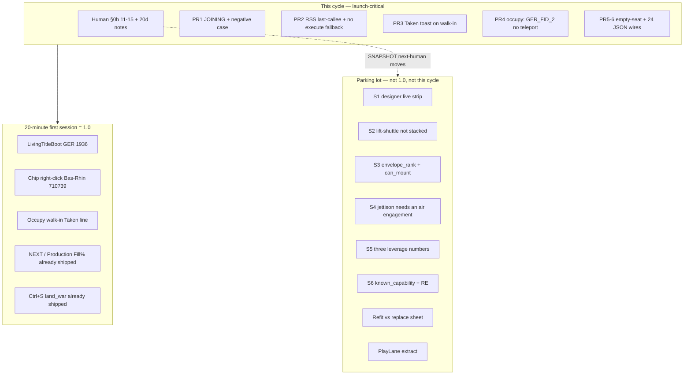
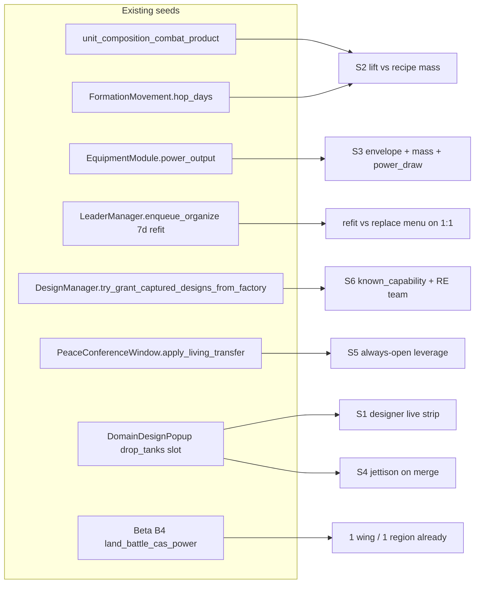
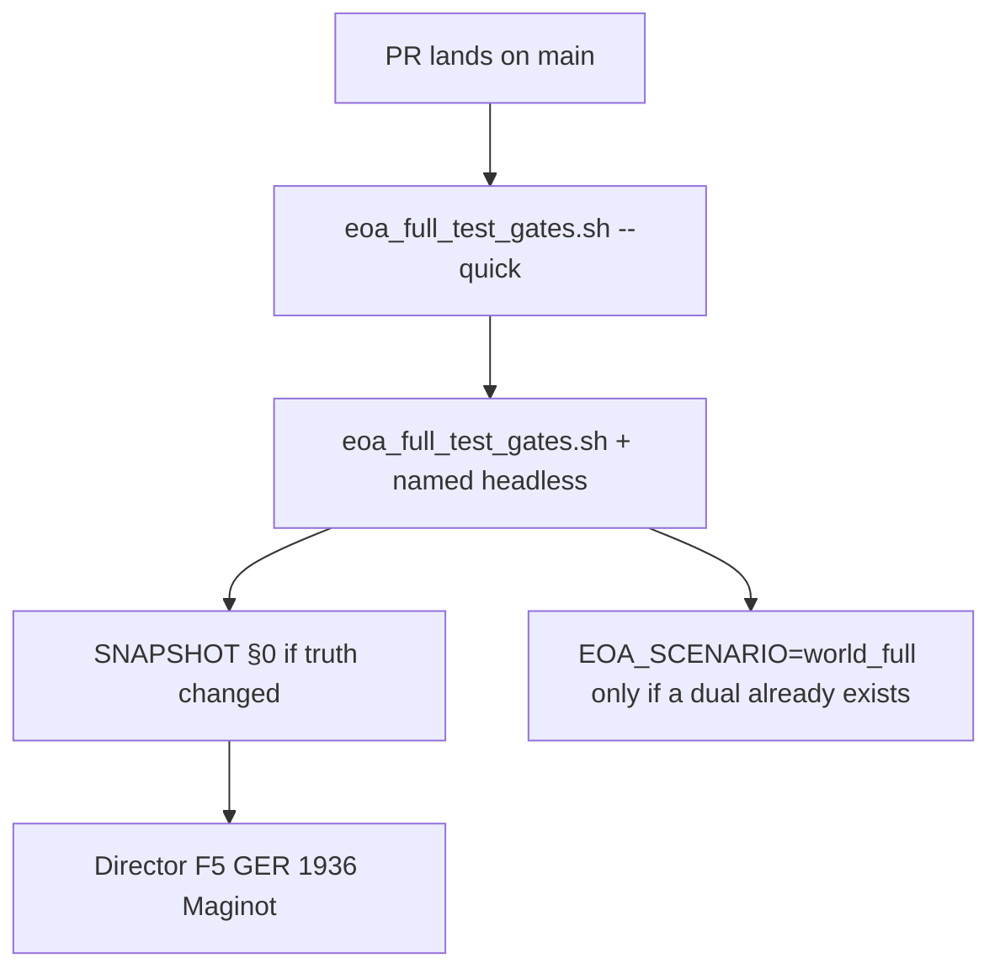

# Epochs of Ascendancy — Post Full-Test Launch Program

| Field | Value |
|-------|-------|
| **Document** | Indie launch ladder: machine-green Maginot → stranger-playable 1.0 |
| **Author** | Grok Design (systems) |
| **Date** | 2026-09-17 |
| **Status** | Draft (rev 3 — JOINING dest `710175`; envelope_rank aircraft < vehicle; Taken `broke` flag; `last_callee()`; 2026-09-18 market findings) |
| **Engine** | Godot **4.7.1** via `tools/run_godot.sh` |
| **Default board** | `world_accurate` **~3520** (`data/provinces_world_accurate/`) |
| **Proof theater** | GER Maginot `710173` vs FRA Alsace `710739` |
| **Live truth** | [`docs/GAME_STATUS_SNAPSHOT.md`](docs/GAME_STATUS_SNAPSHOT.md) always wins |
| **Not a gate** | [`docs/DESIGN_EPOCH_LOOP_INTENT.md`](docs/DESIGN_EPOCH_LOOP_INTENT.md) (player fantasy; not landed) |

If SNAPSHOT, HOI gap review, MASTER, TODO, or this file disagree, **SNAPSHOT wins**. This document is the forward program after machine full-test close. It is **not** a residual dual-package factory.

---

## Overview

Machine full-test is closed. HOI pillar matrix **open P0 = 0** (`hoi_full_test_gap_matrix_product`, 17/17 P0 landed). The default F5 board is `world_accurate` ~3520. Maginot click-order combat (`BattleManager.start_land_battle`, never `execute_province_assault` on the click), production Fill% / stockpile, save `land_war`, and 1918/1936/2026 boot APIs are **shipped**. A stranger still cannot sit down, F5 GER 1936, fight Maginot, produce rifles/trucks, save, and *feel a war* without hitting honest UX holes: JOINING not headless-proven (including the negative “rear GER must not JOIN”), Taken fires on resolve not walk-in, empty-seat portraits hide instead of falling back, 2026 JSON is 47/222 wired, RSS tripwire has no last-callee breadcrumb, and human PLAYTEST §0b 11–15 + M6 20d/60d notes remain blank.

This program is a **realistic indie launch ladder**. **This cycle = Maginot F5 honesty + portraits (PRs 1–6) + the human process gate.** Epoch-loop physics (fit, lift, jettison, RE, leverage math) is a **parking lot**: not 1.0, not this cycle, opens only when SNAPSHOT’s next-human row changes. Launch 1.0 is **one theater-quality land war + production + save + three-era boot** — not commercial HOI4, not museum borders, not a new dual-package wave, not Intent §14 dumped as numbered PRs.

---

## Background & Motivation

### What is actually true (2026-09-17)

| Fact | Evidence |
|------|----------|
| Map machine closed | SNAPSHOT §1: M0–M5, A2/A2b, Fronts, WarLoop, Command Center save |
| HOI P0 closed | `docs/HOI4_EOA_GAP_REVIEW.md` · `test_hoi_full_test_gap_matrix_product` · open P0 = 0 |
| Maginot living loop (machine) | `HeadlessWorldAccurateUnitOrderLoopTest` parks GER `710173` / FRA `710739`; `living_unit_order_loop_product` on `--quick` |
| Click-order combat | Right-click / Ctrl+click → `start_land_battle`. Will-gate if `can_assault` fails. Occupy walk-in after break |
| Production → TOE | `ProductionManager.unit_toe_fill_ratio` · `reinforce_unit_toe_from_stockpile` · empty stock invents nothing |
| Play-strip Production | `TopInfoBar.open_living_surface("production")` — living factory board, not `apply_production` dual |
| Save | `SaveLoadManager` blob `land_war`; `validate_long_session_save`; Ctrl+S/L; 7d autosave killswitch |
| Three-era boot (machine) | `LeaderManager.boot_living_player` · `TimeManager.boot_living_era` · `LivingTitleBoot` · `EOA_PLAYER_TAG` / `EOA_START_YEAR` |
| Soft 30fps | Honest FAIL ~29.4 fps (map-tick proxy mean 34.01 ms) |
| M6 | Human 20d/60d narrative **open** — not automated |
| Dual scaffold | `EOA_SCENARIO=world_full` (~2665). **Never renumber those IDs.** |

### Pain points (verified in code, not invented)

1. **Human playtest is the remaining full-test gate.** PLAYTEST §0b items 11–15 and M6 notes in [`docs/SESSION_NOTES/2026-08-05_m6_smoke.md`](docs/SESSION_NOTES/2026-08-05_m6_smoke.md) are still blank or partial. Machine cannot fake this. Catalogue [`docs/SESSION_NOTES/2026-09-17_maginot_play_catalogue.md`](docs/SESSION_NOTES/2026-09-17_maginot_play_catalogue.md) is a combat-loop log, **not** M6 complete.

2. **JOINING is implemented, not proven — and the happy path is too coarse.** `BattleManager.note_march_toward_battle` writes `att_pending_fids` when dest is the open fight’s `from_id` or `to_id`; `build_fight_briefing` emits roster status `"joining"`; MapRenderer fight-card title appends `+%d joining`. `FormationMovement.enqueue_own_land_march` already calls `note_march_toward_battle`. **`try_reinforce_land_battle` ENGAGES immediately** when an attacker arrives on **either** `from_id` or `to_id` (pending erased). **`HeadlessWorldAccurateUnitOrderLoopTest` has zero JOINING assertions** (it already parks `GER_FID_2` = `uol_ger_stack` on Rastatt `710176`). Catalogue next-session step 3: rear GER click a **German neighbor** must **not** JOIN. A test that only marches onto the fight hex can lock in “any own-land hop near Maginot lists JOINING.”

3. **Taken fires on resolve, not walk-in.** `MapRenderer._close_fight_card_taken` toasts `Taken · %s · %s` and `queue_free`s `FightCard` on resolve. Occupy-pending path toasts `They broke · occupying %s · walk in to take it` then closes the fight box. Empty-hex occupy already toasts `Took %s · no opposition` from `_on_march_hop_ui` when `occupy.captured`. After post-break `tick_all_marches` walk-in, there is **no “they broke” Taken line** and `_show_fight_card` **returns immediately when headless**, so a new MapRenderer panel cannot be the proof. Catalogue wants one line then close — use `_province_display_name(to_id)` / **Bas-Rhin** (`710739`), never hardcode Haut-Rhin (`710740`).

4. **Portraits: empty-seat exists, unwired; 2026 mostly unwired.** `.grok/skills/eoa-portraits/SKILL.md`: `assets/graphics/ui/leader_empty_seat.png` (+ `_64`) exist; `LeaderDetailScreen._update_header` **hides** `portrait_rect` when `portrait_path` is empty; `LeaderAssignmentScreen._create_leader_row` sets `p_rect.visible = p_rect.texture != null`. Recount 2026-09-17: 1918 **136/136** wired, 1936 **99/99** wired, 2026 **47/222** wired (175 empty). **24** 2026 `leader_id.png` files exist on disk with no JSON `portrait` field. Disk PNG without JSON is invisible at runtime.

5. **Epoch loop is a freeze of intent, not a backlog to dump.** `DESIGN_EPOCH_LOOP_INTENT.md` §14: “Do not start this list until SNAPSHOT next human work is in play **or** a playtest names a hole these rules fix.” Fit budgets (`envelope` / `mass` / `power_draw`) are **not** on `EquipmentModule` today — only `power_output`. Lift vs mass is **not** in `FormationMovement.hop_days` (terrain × infra × template speed only).

6. **HOI PARTIAL depth is a trap if treated as DLC parity.** Gap review §3: designer UX, deeper fuel *network*, naval TF micro, ideology UI are post-full-test polish. Duals already prove hooks. The player loop stays thin if we add more duals.

### Why this change is needed now

Director plan Phase D6+ and MASTER still catalogue GameData mega-split, densify, HOI designers. Residual board ranks M6 human notes #1 and defers those. The next program that actually ships a game is: **keep Maginot honest and close the 20-minute first-session holes.** Epoch slices stay parked until SNAPSHOT next-human is no longer “§0b remaining + 20d notes.” Anything else is dual spam or a rewrite.

---

## Goals & Non-Goals

### Goals

1. **Human playtest close** — PLAYTEST §0b items 3–15 marked; at least one 20-day unpause note appended to M6 smoke. Machine does not claim this.
2. **First-session 20-minute loop** a stranger can complete: pick GER 1936 → Maginot chip → declare/assault → occupy walk-in → NEXT → Production Fill% → Ctrl+S.
3. **HOI PARTIAL that is worth landing this cycle** is already shipped as thin surfaces (G fuel brief, Channel sea hop, living production board, field-on-map designer). Explicitly reject Paradox DLC parity. Designer live strip / fit / lift are **parking-lot**, not 1.0.
4. **Epoch-loop slices** are specified so they can open later without inventing physics; they are **not this cycle’s PRs**.
5. **Content honesty** — JSON roster is truth; empty-seat fallback; 2026 isolated; wire the 24 on-disk 2026 portraits.
6. **Launch bar** — 1.0 = theater-quality land war + production + save + 3-era boot. Steam-page 1.0 exclusions are explicit. Fit/lift/jettison/RE/leverage-math are **not** 1.0.
7. **Gates** — every launch PR names the **headless** `_test_*` / `RESULT=PASS`. Greps are not ready. Merge **stops after PRs 1–6** until SNAPSHOT next-human moves.

### Non-goals (do not treat as gates, do not open as PRs)

- Museum borders, ~13k HOI provinces, multiplayer product, full V3 markets/pops
- Commercial HOI division / naval / air designer suite
- GameData mega-split (~43k lines)
- New residual dual packages (`*_primary_live` domains)
- Densify / SE Asia micro-merge unless a human names soup
- Merge `origin/cursor/*` or `execute-plan/ceb60fdd-*`
- Invented 30fps PASS (proxy still ~29.4)
- M6 20d/60d as an automated gate
- Rifle I/II/III SKU years; locked-peace warscore walls; tech-only airpower
- Full fuel-network economy, HOI TF micro, ideology/party UI clone
- Space life-support grocery sim; mid-air refuel; 1936 fake-smart munitions

---

## Key Decisions

| # | Decision | Rationale |
|---|----------|-----------|
| **K1** | **Maginot F5 honesty before epoch-loop physics.** | SNAPSHOT next human work is §0b + 20d notes. Intent §14 forbids starting fit/lift/RE while Maginot is the freeze. A stranger who cannot finish Maginot will not notice envelope classes. |
| **K2** | **Launch 1.0 = one theater-quality land war + production + save + 3-era boot.** Epoch S1–S6 are **not 1.0**. | Indie bar. Not commercial HOI4. Steam page must not promise naval designer, ideology DLC, 13k provinces, MP, fit budgets, or jettison. |
| **K3** | **Thin living surfaces on shipped APIs, not new domains.** | Production already opens `TopInfoBar.open_living_surface("production")`. Peace already has `PeaceConferenceWindow.apply_living_transfer`. Assault already has `open_living_assault`. Duals already exist; they are regression, not the player loop. |
| **K4** | **This cycle: JOINING (with negative case) → RSS breadcrumb → Taken-on-walk-in toast → occupy no-teleport → portraits. PlayLane is hang-class insurance, not PR 1.** | JOINING APIs exist but have no harness (including “rear GER must not JOIN”). RSS tripwire already pauses at 2.5 GB; only last-callee is missing. Taken is a resolve toast; a new FightCard-class panel is hang-class-adjacent — prefer the existing hop toast + `LandBattleAar` helper. Catalogue orders RSS before JOINING because graphical 1× is the stranger freeze; this DAG still does JOINING first as the **machine-provable** loop hole, and puts the RSS breadcrumb as PR 2 (S, no Taken dep) so 1× debug is not blocked on Taken UI. PlayLane stays optional (Open Question 4). |
| **K5** | **Empty-seat fallback is a product task; 2026 JSON wire is content, not generation.** | PNG exists. UI hides. Skill `eoa-portraits` already names this. 24 of 175 unwired 2026 rows have matching `leader_id.png` on disk — wire JSON only. Do not invent names in GDScript. |
| **K6** | **HOI PARTIAL traps: fuel network, naval TF micro, ideology UI, commercial designer.** | Gap review marks them PARTIAL/DEFER. Fuel brief + hub rank already on **G**. Channel hop already `enqueue_own_sea_hop`. Hidden-hand exists. Designer already fields chips via `LeaderManager.field_designed_unit`. DLC-parity is a year of work that does not make Maginot feel like a war. |
| **K7** | **Parking-lot epoch slices extend seeds; they are specified, not scheduled.** | Intent §1 + §14. When SNAPSHOT next-human moves: `can_mount` (not lexicographic envelope strings), lift-shuttle **does not stack** on slowest-element, jettison needs an engagement that is not CAS. Until then, no PR numbers in the launch DAG. |
| **K8** | **Greps are not ready. Named headless `RESULT=PASS` is ready.** | Skill `eoa-living-units` / `eoa-check-work`. Product `living_unit_order_loop_product` ANDs greps; the gate that ships is `HeadlessWorldAccurateUnitOrderLoopTest`. |
| **K9** | **No GameData split, no new dual packages, no `world_full` ID renumber, no densify this cycle.** | AGENTS.md + SNAPSHOT deferred list. PR 1 must not be “rewrite GameData” or “densify SE Asia.” |
| **K10** | **Observability is not SaaS.** Headless RESULT, SNAPSHOT when truth changes, killswitches, `--quick` on the official gate. Rollout = `world_accurate` F5; dual `world_full` only if a dual already exists. |
| **K11** | **Roster chain stays: 1918 then 1936 for `world_accurate`; 2026 isolated.** | `LeaderManager.SCENARIO_LEADER_ROSTER_CHAIN`. Do not merge WW-era ids into 2026. |
| **K12** | **Click / AI initiator uses `start_land_battle`, never `execute_province_assault`.** Hang-class: no 3520 BFS on G/L; no `ClassName.has_method()` on RefCounted `class_name`; no full inspector rebuild on pick; chip text is Node2D; Godot only via `tools/run_godot.sh`. | Residual footgun: `MapRenderer` still `execute_province_assault`s if `start_land_battle` is missing (around the “Multi-day open” guard). PR 2 assert-fails that fallback on the F5 click path. DebugOverlay may keep execute. |
| **K13** | **Merge stop after launch-critical PRs 1–6.** | Epoch parking-lot work is not “the next PR.” Production living-surface and empty-stock are already gated — do not open a no-op regression PR. SNAPSHOT updates only when truth changes (pointer OK; do not paste a 1.0 manifesto into SNAPSHOT). |

---

## Locked facts (do not contradict)

- Default board: `world_accurate` **~3520** (Europe NUTS 710000+, US 800000+, RoW 900000–949999, seas 950000+). Dual `EOA_SCENARIO=world_full` only. Never renumber `world_full` IDs.
- Maginot proof: GER `710173` vs FRA `710739`. Click uses `BattleManager.start_land_battle`.
- Autoloads live in `project.godot` (`GameData`, `BattleManager`, `LeaderManager`, `ProductionManager`, `SaveLoadManager`, `TimeManager`, `MapManager`, …). Do **not** add `class_name` matching a singleton. `FormationMovement` is `class_name` + statics — call `FormationMovement.enqueue_own_land_march`, never `FormationMovement.has_method(...)`.
- Production: named design = stockpile key. Empty stock invents nothing. Play-strip opens `TopInfoBar.open_living_surface("production")`.
- Killswitches: `EOA_AI_LAND_BATTLES`, `EOA_INTERACTIVE_MULTI_AI`, `EOA_AI_INFRA`, `EOA_UNIT_ORDER_QA`. Also `EOA_CALENDAR_AUTOSAVE=0`, `EOA_SKIP_TITLE`, `EOA_PLAYER_TAG`, `EOA_START_YEAR`.
- Soft 30fps FAIL honest (~29.4). M6 20d/60d notes are human-only.

---

## Proposed Design

### Program shape

Two tracks. Epoch is **off** the 1.0 path until SNAPSHOT says otherwise.



**Freeze rule:** parking-lot slices may open only when (a) SNAPSHOT next-human is no longer “§0b remaining + 20d notes”, **or** (b) a playtest names a hole those rules fix. Until then, machine work is shipped-path Maginot/UX + portraits only. **Do not treat S1–S6 as the continuation of the numbered launch DAG.**

---

### 1. Human playtest close

**Owner:** human director + co-pilot. **Not a machine PR.**

Launch:

```bash
tools/run_godot.sh --path . res://scenes/TestScenario.tscn
```

Protocol (SNAPSHOT §0 + PLAYTEST §0b):

| # | Action | Expect | Current |
|---|--------|--------|---------|
| 1–2 | Load + Home/End | ~3520, Europe/Asia/world | ✓ (M6 smoke 2026-08-07/17) |
| 3–7 | Capitals, mapmodes, Fronts/**B** | Names, fills, toast | ✓ 2026-08-17 |
| 8 | WarLoop / Shift+I | Toast-only; no 3520 overlay | hang-class closed; re-check honestly |
| 9 | **I** EquipmentFlow | Skip until cheap | skip |
| 10 | **G** corridor | Toast + deferred hop-capped path; no 3520 BFS | hang-class closed; re-check honestly |
| **11** | Maginot chip right-click Alsace | Fight starts if at war; will-gate otherwise; 1× drains org | catalogue 2026-09-16/17; **§0b row still unmarked** |
| **12** | Corridor / supply story | Readable without freeze | unmarked |
| **13** | Ctrl+S / Ctrl+L | State survives | machine `living_playtest_saveload_roundtrip`; **human unmarked** |
| **14** | Advance 5–10 days | No freeze; toasts readable | 1× RSS still hang-class until Maginot break stays ~2 GB |
| **15** | Rear GER march + reinforce | March toast; dest **`710175`** must **not** JOIN; dest `710739`/`710173` JOINING then ENGAGED | API shipped; **not headless-proven** (PR 1; fixture must add `710175`) |

**M6:** one 20-day unpause with notes (produce → fight → Fill% visible without F10). 60-day is the same template, later. Append [`docs/SESSION_NOTES/2026-08-05_m6_smoke.md`](docs/SESSION_NOTES/2026-08-05_m6_smoke.md). Do not invent complete.

**Machine while human is out:** occupy-after-win headless (already in `_test_occupy_after_win`) + `GER_FID_2` no-teleport (PR 4); JOINING three beats (PR 1); RSS last-callee (PR 2); Taken `kind=taken` on walk-in (PR 3). Do **not** re-enable F5 `day_ai` / calendar autosave until Maginot 1× is stable for 30+ days (catalogue).

**Exit:** SNAPSHOT §0 next-human row updates because a human marked §0b 11–15 and filed a 20d note — not because a product grep turned green.

---

### 2. First-session 20-minute loop

Target player story (GER 1936, paused, title auto-Begins via `LivingTitleBoot` / `TestRunner`):

```mermaid
sequenceDiagram
  participant P as Player
  participant Title as LivingTitleBoot
  participant Chip as DemoUnitIcon 710173
  participant BM as BattleManager
  participant FM as FormationMovement
  participant Prod as TopInfoBar
  participant Save as SaveLoadManager

  P->>Title: Begin GER 1936
  Title->>Title: boot_living_player GER / boot_living_era 1936
  P->>Chip: click (pin-first)
  P->>Chip: right-click Bas-Rhin 710739
  alt not at war
    Chip->>P: will-gate Declare war
    P->>BM: apply_war_goal_execute
  end
  Chip->>BM: start_land_battle
  BM->>P: Fight card NvM + Likely/Tight/Bad
  P->>Chip: 1x until FRA breaks
  Note over BM: hex stays FRA, occupy_pending; Fight card already closed
  FM->>FM: tick_all_marches walk-in
  Note over Chip: owner GER — Taken toast via LandBattleAar helper, not a new panel
  P->>Prod: play-strip Production / NEXT shortage
  Prod->>Prod: open_living_surface("production")
  Note over Prod: Fill% + stock rifles/trucks; empty invents nothing
  P->>Save: Ctrl+S
  Save->>Save: land_war blob required
```

#### Shipped APIs (do not rebuild)

| Beat | API | File |
|------|-----|------|
| Title / nation / era | `LivingTitleBoot.apply_living_title_boot` · `LeaderManager.boot_living_player` · `TimeManager.boot_living_era` | `scripts/ui/LivingTitleBoot.gd`, `LeaderManager.gd`, `TimeManager.gd` |
| Pin-first pick | `_try_open_unit_at_world` | `MapRenderer.gd` |
| Own-land march | `FormationMovement.enqueue_own_land_march` | `scripts/formations/FormationMovement.gd` |
| Assault | `BattleManager.start_land_battle` · `MapRenderer.open_living_assault` | `BattleManager.gd`, `MapRenderer.gd` |
| Join | `try_reinforce_land_battle` · `note_march_toward_battle` | `BattleManager.gd` |
| Occupy-after-break | `_begin_occupy_after_victory` → `FormationMovement.enqueue_occupy_adjacent` per `att_fids` (requires adjacent) · `tick_all_marches` · `BattleManager.resolve_occupy_arrival` | `BattleManager.gd`, `FormationMovement.gd` |
| Owner flip (single fid) | `_apply_attacker_win_capture_light(att_tag, to_id, from_id, att_fid)` — **one** fid, not the auto-occupy loop | `BattleManager.gd` |
| Fight card | `build_fight_briefing` · `FightCard` | `BattleManager.gd`, `MapRenderer.gd` |
| AAR | `LandBattleAar.format_line` / `economy_sentence` | `scripts/combat/LandBattleAar.gd` |
| NEXT | `PlayNextHook.rank_from_snapshot` / `apply` | `scripts/ui/PlayNextHook.gd` |
| Production | `TopInfoBar.open_living_surface("production")` · `unit_toe_fill_ratio` · `reinforce_unit_toe_from_stockpile` | `TopInfoBar.gd`, `ProductionManager.gd` |
| Fill% chrome | `UnitCardCombatStrip._fill_percent_line` · `_stockpile_stock_line` | `scripts/ui/UnitCardCombatStrip.gd` |
| Field / recruit | `DesignManager.field_design_on_map` · `LeaderManager.enqueue_organize` | `DesignManager.gd`, `LeaderManager.gd` |
| Save | `_gather_save_data` / `_apply_save_data` · `land_war` | `SaveLoadManager.gd` |
| Peace annex | `PeaceConferenceWindow.apply_living_transfer` | `PeaceConferenceWindow.gd` |

#### Remaining UX holes (this program closes)

| Hole | Shipped today | 1.0 need | Severity |
|------|---------------|----------|----------|
| **JOINING** | `att_pending_fids` + title `+%d joining` + roster `"joining"` | Three harness beats (see API JOINING): dest **`710175`** in `_setup_maginot_map`; `GER_FID` opens fight first; negative no-JOIN; pending; ENGAGED. `Script.load` + `call`. | **P0 launch** |
| **Taken on walk-in** | Resolve toast + FightCard free; empty-hex `Took %s · no opposition`; `resolve_occupy_arrival` has no `broke` | Stamp `broke` / `from_pending_occupy` on post-break hop; `resolve_occupy_arrival` returns `kind=taken`; toast `they broke` not `no opposition`. Bas-Rhin `710739`. **No new panel.** | **P0 launch** |
| **Occupy teleport** | `_begin_occupy_after_victory` already loops `att_fids` + adjacent-only `enqueue_occupy_adjacent` | Harness: `GER_FID_2` on Rastatt `710176` does **not** teleport to `710739`. Diagnose F5 `GER_formation_4` before adding a filter that may already match. | **P0 launch** |
| **RSS last-callee** | `TimeManager._maybe_trip_rss_budget` pauses at 2.5 GB; print has no last call | `note_last_callee` + **`last_callee()` getter** (harness-readable). Both F5 click sites honest (including ~20416 `else`). | **P0 hang-class** |
| **Empty-seat portrait** | PNG on disk; UI **hides** TextureRect | Fallback empty-seat; never hide; non-`res://` path treated as empty. | **P1 session feel** |
| **2026 unwired portraits** | 47/222 JSON; 24 disk files listed in Content | Wire those 24 ids only. Isolated 2026 roster unchanged. | **P1 content** |
| **§0b 11–15 unmarked** | Machine occupy-after-win PASS | Human marks. | **P0 process** |
| **Play-strip / Fill% / empty stock** | Already gated (`order_panel_play_strip_product`, harness empty-stock) | **Do not regress.** Not a standalone PR. | regression only |

Nation pick feel is **already** `LivingTitleBoot` (8 majors, 3 eras, Begin). Default F5 stays GER Maginot unless `EOA_PLAYER_TAG`. Do not invent a second title screen.

---

### 3. HOI PARTIAL depth — land vs trap

From [`docs/HOI4_EOA_GAP_REVIEW.md`](docs/HOI4_EOA_GAP_REVIEW.md). Open P0 stays **0**. Do not re-open closed P0.

| PARTIAL | Land (thin living surface) | Trap (do not start) |
|---------|----------------------------|---------------------|
| **Designer UX** | **This cycle:** keep field-on-map + organize queue. Live strip is parking-lot S1 (not 1.0). | HOI battalion designer, 3D preview, efficiency tables, conversion UI. SNAPSHOT: “Still not commercial HOI battalion designer.” |
| **Fuel network** | Keep **G** hub rank + `fuel_score` toast (`map_supply_hub_brief_product`). Keep formation `fuel_level` burn on march/combat (already composition depth). Dry tanks already slow. | HOI supply-hub graph, rail capacity sim, province-by-province fuel economy. Residual #11 deferred. |
| **Naval TF micro** | Keep ENG Channel `950001` → North Sea `950000` via `enqueue_own_sea_hop` (no land BFS). Document 1 fleet ≤ 3 adjacent sea zones when a playtest asks. Choke 34 already painted. | HOI task-force designer, mission editor, screening, naval combat 3D. Gap review: non-goal for full-test; still non-goal for 1.0. |
| **Ideology UI** | Hidden-hand + cultural modifiers already exist (`HIDDEN_HAND_DESIGN.md`). Do not build a living politics screen this cycle. | HOI party popularity, advisor cabinet, national spirit designer clone. |

**Rule:** if a PARTIAL cannot be shown on Maginot GER in 20 minutes, it is a trap for 1.0.

---

### 4. Epoch loop slices — **parking lot (not 1.0, not this cycle)**

Canonical intent: [`docs/DESIGN_EPOCH_LOOP_INTENT.md`](docs/DESIGN_EPOCH_LOOP_INTENT.md) §14. Each slice **extends a seed**, not a new domain.

**Do not implement these until SNAPSHOT next-human is no longer “§0b remaining + 20d notes” (or a playtest names the hole).** Specs below exist so a later engineer does not invent lexicographic envelope compares, stacked lift+speed penalties, or a fake “air merge” on CAS. They are **not** launch PRs.



| Slice | Seed to extend | Player-facing | Proof when opened | Explicitly later |
|-------|----------------|---------------|-------------------|------------------|
| **S1 Designer live strip** | `DomainDesignPopup` stats label + module toggles | Add truck → “Fill +4 · speed +0.2”. Drop tanks: hung vs jettisoned columns (display only until S4). Red = illegal via `can_mount`. | Pure helper + `--quick` product; F5 can see it | Full CAD |
| **S2 Lift → hop days** | See physics freeze below. **Do not stack** on slowest-element. | `Move 2 hops/day · lift 70% · +1 day per 2 hexes` only when partial motorization | Headless: partial-truck extra days vs full-truck; foot-only **unchanged** | Helicopter/airlift era |
| **S3 Envelope + mass + power** | `EquipmentModule.power_output` today; DesignManager dict already reads `power_draw` default 8.0 and `mass`/`weight` default 6.0 — **unify** onto the Resource | “Radar Mk I: capital. Fighter envelope: aircraft. Don’t mount.” Brown-out if draw > plant | `can_mount` illegal radar-on-fighter fails; 4-engine plant can feed a set the fighter cannot | Miniaturization tree content dump |
| **S4 Jettison** | Air slot `drop_tanks` exists. CAS is `land_battle_cas_power` on **land** ticks — **not** an air merge | Needs a real air engagement (new) or an explicit “CAS ingress” rule. Do **not** overload CAS. | New headless function; agility/range/stock fields named | Mid-air refuel, heavy wings |
| **S5 Peace leverage numbers** | `open_living_sheet` already `opened: true` (no brick wall). Apply is one-pid annex + unrest. UI leverage today is **agent inclusion** (`get_inclusion_leverage`), not Intent’s three scores | Add three computed numbers at open: leverage / capacity / follow-through | Pure helper with named formulas; surround still `opened=true` (already) | Puppet AI, nuclear-as-leverage |
| **S6 Wreck → RE** | `DesignManager.try_grant_captured_designs_from_factory` | Capture sets `known_capability`; RE team ticks; success = component/shrink, not free chassis | Headless capture on Maginot-scale pid | Instant steal-all |

#### S2 physics freeze (when opened)

Maginot **1.0 movement axis stays** `LandCombatPower.template_speed` = slowest remaining element (`SKIP_SPEED_WHEN_MOUNTED` drops foot when trucks exist) × `fuel_speed_mult` (dry: `fuel_level < 0.35` and `fuel_use > 0` → `0.45 + 0.55 * (f/0.35)`). `hop_days` = `BASE_HOP_DAYS * terrain * infra * (1/speed)` clamped 0.25–3.0.

**Do not also multiply shuttle on that speed.** S2, if opened, is **partial motorization only**:

| TOE keys | `organic_lift` | `recipe_mass` (t-eq freeze) |
|----------|----------------|-----------------------------|
| On-hand `trucks` + `halftrack`/`half_tracks` | 1.0 t-eq per truck stock unit; 1.5 per half-track | Infantry bn 1.0; artillery 1.5; tank bn 3.0 (from composition `EL_EQUIP` counts × those weights) |

- `organic_lift == 0` (foot Maginot 3 inf): **no shuttle**. Speed 1.0. Plains infra 1.0 hop = `1/1.0` = **1.0 day**.
- Full trucks, 3 inf (`mobility=truck`): infantry skipped in speed; speed 2.0. Plains hop = **0.5 day**. Lift ≥ mass → **no shuttle**.
- 3 inf + 2 tank bn + 2 trucks, mass 3×1 + 2×3 = 9, lift 2: `lift_ratio = 2/9`. Slowest-element already `min(truck, tank)`. Shuttle extra: `days *= 1 + (1 - lift_ratio)` **instead of** changing template speed further. Worked: if speed stays tank/truck min 1.5 → base hop `1/1.5 ≈ 0.67`, × `(1 + 7/9) ≈ 1.78` → **~1.2 days** (then clamp ≤ 3).
- Dry fuel: existing `fuel_speed_mult` still applies to `template_speed`. Dry trucks **do not count** in `organic_lift` (`fuel_level < 0.35` and formation `fuel_use > 0`). Do not invent a second dry penalty.

#### S3 physics freeze (when opened)

Envelope values are **strings**. Never compare with `>`. 

```gdscript
# Intent §3.1 largest → smallest: facility → capital → cruiser → destroyer → vehicle → aircraft → manpack
# Miniaturization climbs **down** vehicle → aircraft → manpack. Never string-compare envelopes.
const ENVELOPE_RANK := {
	"manpack": 0, "aircraft": 1, "vehicle": 2, "destroyer": 3,
	"cruiser": 4, "capital": 5, "facility": 6,
}
static func envelope_rank(s: String) -> int:
	return int(ENVELOPE_RANK.get(s.strip_edges().to_lower(), 2))  # default vehicle
# can_mount iff envelope_rank(component) <= envelope_rank(chassis)
# aircraft part on vehicle chassis: 1 <= 2 → ok; vehicle part on fighter: 2 <= 1 → refuse
# capital radar on fighter: 5 <= 1 → refuse (radar-on-fighter still illegal)
```

Unify DesignManager dict `power_draw` / `mass` onto `EquipmentModule` (`mass_t`, `power_draw`, `envelope` default `"vehicle"`). Add **`engine_count`** (int, default **1**) on chassis/airframe JSON — plant = `power_output * engine_count`. One function:

`DesignManager.can_mount(component, chassis) -> {ok: bool, reason: String}`

used by `DomainDesignPopup` **and** finalize. Old module JSON loads (defaults).

#### S4 freeze (when opened)

There is **no** air-to-air merge tick. `land_battle_cas_power` is land-battle CAS. Do not hang jettison there.

When opened, pick **one** engagement and name it: new `start_air_intercept` / air-to-air tick **or** an explicit “CAS ingress” hook that is **not** `land_battle_cas_power`. Fields that change: `drop_tanks` stock consumed, `agility` restored to clean-wing, `range` back to internal fuel. Escort-keep is a mission flag on the wing. Proof: a **new** headless function. Mid-air refuel stays later.

#### S5 freeze (when opened)

**Shipped:** `PeaceConferenceWindow.open_living_sheet` returns `opened: true` with no surround brick-wall; `apply_living_transfer` → `GameData.apply_peace_conference_settlement_live` (one pid + unrest). Existing UI number is agent **inclusion leverage** (`get_inclusion_leverage`).

**Add** a pure helper `peace_ask_scores(winner, loser, ask) -> {leverage, capacity, follow_through}` (0–1). Until formulas are playtested, freeze:

- `leverage` = clamp01(0.5 * relative land power in the theater + 0.3 * inclusion leverage + 0.2 * surround/blockade flag)
- `capacity` = clamp01(loser factories/manpower vs ask size; 1.0 for one-pid annex)
- `follow_through` = 0.5 + 0.25 if at war already − 0.25 if competing open land battle

Show the three numbers. Apply path unchanged. A test that only asserts `opened=true` at high surround **already passes** and is not this slice.

**Refit vs replace** (Keep / Refit program / Replace / Mothball / Transfer / Scrap) is the same parking lot: a thin sheet on `LeaderManager.enqueue_organize` 7d refit. **No PR this cycle.** Mass infantry kits stay families (`rifles`, truck batches).

**1 wing / 1 region** is already Beta B4 (GER CAS region 100, `land_battle_cas_power`). Do not clone HOI air-war UI. Fleet ≤3 sea zones is parking-lot documentation + a cap on `enqueue_own_sea_hop`, not a TF editor, **not 1.0**.

---

### 5. Content — leaders and portraits

Roster is JSON, not invented names in GDScript (skill `eoa-portraits`):

- `data/leaders/historical_leaders_1918.json`
- `data/leaders/historical_leaders_1936.json`
- `data/leaders/historical_leaders_2026.json`

Loader: `LeaderManager._load_historical_roster_from_paths`.

**Chain (locked):**

```113:124:scripts/leaders/LeaderManager.gd
const SCENARIO_LEADER_ROSTER_CHAIN: Dictionary = {
	"1910": [HISTORICAL_LEADERS_1910_PATH],
	"1918": [HISTORICAL_LEADERS_1918_PATH],
	"1936": [HISTORICAL_LEADERS_1918_PATH, HISTORICAL_LEADERS_1936_PATH],
	"2026": [HISTORICAL_LEADERS_2026_PATH],
	"world_full": [HISTORICAL_LEADERS_1918_PATH, HISTORICAL_LEADERS_1936_PATH],
	"world_accurate": [HISTORICAL_LEADERS_1918_PATH, HISTORICAL_LEADERS_1936_PATH],
	...
}
```

2026 is isolated (`_roster_paths_are_modern_isolated`); WW-era birth years dropped. `world_accurate` F5 is 1918 then 1936.

**Counts (recounted 2026-09-17 — bulk summary is stale):**

| Roster | Leaders | JSON `portrait` wired | Empty | Missing file |
|--------|---------|----------------------|-------|--------------|
| 1918 | 136 | **136** | 0 | 0 |
| 1936 | 99 | **99** | 0 | 0 |
| 2026 | 222 | **47** | **175** | 0 |
| Disk full PNGs | | 319 | | |
| 2026 unwired **with** `leader_id.png` on disk | | **24** (fixture below) | | |

**Empty-seat fallback (product, not art):**

| UI | Today | After |
|----|-------|-------|
| `LeaderDetailScreen._update_header` | hide TextureRect | load `res://assets/graphics/ui/leader_empty_seat.png` |
| `LeaderAssignmentScreen._create_leader_row` | `visible = texture != null` | load `_64`; always show 24×24 seat |
| Agent rows | similar hide | same fallback optional; out of 1.0 critical path |

Wire JSON `portrait` **only** when the PNG exists. Named real people: `image_edit` from a real reference (skill rule) — not a fresh gen from the name. Generic role seats: invented dieselpunk, 1:1, no text. `_64` is a crop of the same full image.

**PR 5 fixture — 24 `leader_id`s to wire** (`portrait` only; file exists as `assets/graphics/portraits/leaders/<id>.png`):

`aus_air_2026`, `aus_mitchell_2026`, `aus_navy_2026`, `bra_air_2026`, `bra_navy_2026`, `bra_silva_2026`, `can_air_2026`, `can_fraser_2026`, `can_navy_2026`, `ind_air_2026`, `ind_navy_2026`, `ind_sharma_2026`, `isr_air_2026`, `isr_cohen_2026`, `isr_navy_2026`, `kor_air_2026`, `kor_navy_2026`, `kor_park_2026`, `mex_air_2026`, `mex_herrera_2026`, `mex_navy_2026`, `pol_air_2026`, `pol_kowalski_2026`, `pol_navy_2026`.

Named people (`*_mitchell_*`, `*_silva_*`, `*_fraser_*`, `*_sharma_*`, `*_cohen_*`, `*_park_*`, `*_herrera_*`, `*_kowalski_*`): existing files were generated as dieselpunk seats; **do not regenerate** this PR. Generic `*_air_*` / `*_navy_*` are role seats (skill: invented dieselpunk). Isolated 2026 roster unchanged (`SCENARIO_LEADER_ROSTER_CHAIN["2026"]`; `world_accurate` stays 1918 then 1936).

Do **not** claim coverage from git-untracked files. Do not generate a 175-image dump as a launch blocker; 24 on-disk wires + empty-seat makes 2026 boot look staffed, not broken.

---

### 6. Launch bar — what 1.0 means

**1.0 (Steam-page honest sentence):**

> A 1936 Germany start on a real-world map. Click your Maginot division, fight Alsace, occupy it, feed rifles and trucks from factories, save, and boot 1918 / 1936 / 2026.

| 1.0 includes | 1.0 does **not** include |
|--------------|-------------------------|
| `world_accurate` ~3520 F5, SCRIPT ERROR 0 | Museum borders / 13k provinces |
| GER Maginot theater-quality land war (pick → march → assault → occupy → AAR) | Multiplayer product |
| Production living board + Fill% + stockpile; empty invents nothing | Full V3 markets/pops |
| Ctrl+S/L mid-campaign `land_war` | Commercial HOI designer |
| 8 majors playable at title (`LivingTitleBoot`) | HOI TF micro / ideology DLC |
| 1918 / 1936 / 2026 **boot** (roster + era-scaled deposits) | 2026 as a finished modern wargame |
| CHI–JAP second theater **machine** (already B2/B6) as a second front, not the 1.0 review theater | “World war AI campaign” as a Steam promise |
| Channel fleet hop + Maginot CAS as **evidence** the other domains exist | Air/naval as the 20-minute loop |
| Soft 30fps honest | “Smooth 60fps 4K” |
| M6 20d human note filed | “Hundreds of hours of campaign” as a claim |

**Review theater for 1.0 QA:** GER 1936 Maginot only. CHI–JAP / Channel / CAS stay regression (`HeadlessWorldAccurateUnitOrderLoopTest` already covers them). If they break Maginot, they fail the gate; they are not the store-page loop.

**Post-1.0 / parking lot (not this cycle’s PRs):** S1–S6 (live strip, lift, fit, jettison, leverage math, RE), refit-vs-replace sheet, PlayLane, fleet 3-zone cap, ally planner, smart/standoff 2026, space habitat modules, renderer_frame FPS sample.

**1.0 copy lives here and on the residual board.** SNAPSHOT §0 may get a **pointer** plus next-human row when humans mark §0b 11–15. Do not paste this includes/excludes table into SNAPSHOT until those rows are live truth.

#### Market findings (2026-09-18 deep-research run)

Cited from the session deep-research pass ([`HOI_GAP_AND_MARKET_RESEARCH_2026_09_18.md`](HOI_GAP_AND_MARKET_RESEARCH_2026_09_18.md)). **Not SNAPSHOT.** Do not invent extra numbers.

| Finding | Implication for this program |
|---------|------------------------------|
| HOI4 still sells in 2026 (~**33–42k** monthly average concurrent; peak **~93k** Nov 2024) | EOA is not replacing HOI4. 1.0 is a theater war on a real map, not Paradox DLC breadth. |
| Must-land vs HOI pillars | Production, research/focus, land multi-front, basic supply, diplomacy/peace/occupation, intel hooks, OOB, save — **already machine P0 = 0**. This cycle is Maginot honesty so those pillars are *visible*, not new duals. |
| Trap | Commercial designers, TF micro, deep fuel network — same as K6 / HOI PARTIAL traps. |
| Indie win | A **20-minute fail-fast Maginot session**, not 12-hour opaque onboarding. Matches the first-session loop (pick GER → Bas-Rhin → occupy → Fill% → save). |
| V3 pops/markets | Non-goal: combinatorial pop explosion. |
| Lockstep MP | Non-goal: years of PDS rewrite + OOS. `NetSessionManager` stays idle. |
| 1.0 ship shape | Long-polished **Early Access** is allowed (Terra Invicta ~**3y** EA). Do not read “1.0” as Steam-complete vs HOI4. |

TAM, wishlists, price, and review-score targets remain **unknown** — see Open Questions. Do not put a number on the store page from this table beyond the cited concurrent/peak and EA duration.

---

### 7. Gates — how each PR proves itself

**Official gate (always):**

```bash
tools/eoa_full_test_gates.sh --quick    # while iterating (pure)
tools/eoa_full_test_gates.sh            # before claiming done (pure + headless)
```

`--quick` never launches Godot. Full path: `launch_pick` · `launch_assault` (`HeadlessWorldAccurateMultiFrontAssaultTest`) · `launch_unit_order` (`HeadlessWorldAccurateUnitOrderLoopTest` **RESULT=PASS**). Soft 30fps is `--with-perf` evidence, not a hard gate.

**Per-PR proof table — launch-critical only** (parking-lot slices have no gate this cycle):

| Work | Named headless / unit test that must fail if reverted |
|------|------------------------------------------------------|
| JOINING | `_test_joining` three beats with dest **`710175`** registered in `_setup_maginot_map`; `GER_FID` opens the fight first. Product may AND greps; **greps alone are not ready**. |
| RSS last-callee | Harness `note_last_callee("start_land_battle")` then `last_callee() == "start_land_battle"`. Both click sites honest. |
| Taken | Occupy-after-win: `resolve_occupy_arrival` / hop `kind=taken` **and** `broke` after owner GER — not helper-in-isolation, not empty-hex, not FRA-still-owner break. |
| Occupy no-teleport | Same harness: `GER_FID_2` (`uol_ger_stack`) stationed `710176` after Maginot break+walk-in. |
| Empty-seat | Unit test: empty / non-`res://` path → empty-seat constant; rect stays visible. |
| 2026 24-wire | Python fixture of the 24 ids: each has `portrait` and file exists; 0 missing files. `boot_living_era(2026)` still PASS. |

**Greps are not ready.** Skill `eoa-check-work`: claim ready only on `RESULT=PASS` / `PASS (failures=0)`.

**Hang-class greps that stay green** (do not “fix” FAIL by putting Control Labels back on chips):

- no 3520 BFS / `preview_player_route` / `find_land_path` on **G** or **L**
- no `ClassName.has_method()` on RefCounted `class_name`
- no full inspector / `_update_unit_icons_for_test` on pick or assault click
- chip text Node2D, not Control Labels
- `start_land_battle` on click, never `execute_province_assault`

---

## API / Interface Changes

### JOINING (extend, do not replace)

Already shipped:

```gdscript
# BattleManager.gd
func note_march_toward_battle(formation_id: String, dest_id: int, country_tag: String = "") -> Dictionary
func try_reinforce_land_battle(formation_id: String, province_id: int, country_tag: String = "") -> Dictionary
func build_fight_briefing(battle: Dictionary, player_tag: String = "") -> Dictionary
# briefing["ours"] rows: {status: "joining"|"engaged", ...}
```

**Harness `_test_joining` — three beats.** Load movement via `Script.load` + `call`, never `FormationMovement.has_method()`.

**Fixture (required):** `_setup_maginot_map` today only registers GER land `710173`, `710176`, `710300`. Rastatt `710176` world-accurate neighbors include `[710173, 710174, 710175, 710182, 710183, 710184, 710188, 710483, 710739]` — **also adjacent to fight hex `710739`**. Berlin `710300` is not an adjacent own-land hop. Dest `710174`/`710175`/… are `"no dest"` unless registered.

- Add **`GER_NEIGHBOR := 710175`** (GER plains, adjacent to `710176`; real adjacency already has the edge).
- Register it in `_setup_maginot_map` rows as GER plains (`owner_tag`/`controller_tag` GER, `terrain` plains, same Maginot region 100).
- **Setup order:** `GER_FID` (`uol_ger_maginot` on `710173`) opens Maginot `start_land_battle(GER, 710739, 710173, GER_FID)` **first**. Then `GER_FID_2` (`uol_ger_stack` on `710176`) runs beats 1–3. Without the open fight, “no joining” is vacuously true.

1. **Negative:** enqueue `GER_FID_2` dest **`710175`** (not `710173`, not `710739`). Briefing has **no** `"joining"` row for that fid; `att_pending_fids` does not contain it. Catalogue: rear GER click a German neighbor must not JOIN.
2. **Pending before arrival:** enqueue dest fight `from_id` `710173` **or** `to_id` `710739`. `710176`↔`710739` is a **legal direct JOIN hop** (beat 2 may use `to_id` from Rastatt). `note_march_toward_battle` → `att_pending_fids` contains fid and briefing status `"joining"` **before** `tick_all_marches` arrival.
3. **ENGAGED after hop-in:** `tick_all_marches` + `try_reinforce_land_battle` (ENGAGES immediately on arrive at either `from_id` or `to_id`) → fid in `att_fids`, status `"engaged"`, pending dropped.

Click path still `start_land_battle`. Greps of `att_pending_fids` alone are **not** ready.

### Taken on walk-in (toast + static helper, not a new panel)

`_show_fight_card` **returns immediately when `DisplayServer` is headless**. A MapRenderer Taken panel cannot be the proof and collides with hang-class sites.

**Prefer:** Fight card already closes on break (`occupy_pending`). Empty-hex occupy already toasts `Took %s · no opposition` when `occupy.captured`. `resolve_occupy_arrival` today returns `{ok, fought, captured}` only — same `captured: true` for empty hex and post-break walk-in (`_apply_attacker_win_capture_light`). **Do not** let Maginot walk-in reuse `no opposition`.

**Flag the hop.** When `_begin_occupy_after_victory` enqueues occupy, stamp the order `from_pending_occupy: true` / `broke: true`. `resolve_occupy_arrival` (or the occupy hop dict) returns:

```gdscript
# BattleManager.resolve_occupy_arrival — post-break walk-in
# {ok, captured: true, fought: true, broke: true, from_pending_occupy: true, kind: "taken", place, to_id}
# empty-hex occupy: broke false, kind omitted or "empty" → existing "no opposition" toast
```

```gdscript
# LandBattleAar.gd — headless-safe, no Window
static func taken_event(to_id: int, place: String, economy: String = "") -> Dictionary:
	# place from _province_display_name(to_id) / MapManager.get_province(to_id).name
	# Maginot 710739 = "Bas-Rhin" (Alsace). Never hardcode Haut-Rhin (710740).
	var line := "Took %s · they broke" % place
	if not economy.is_empty():
		line += " · " + economy
	return {"ok": true, "kind": "taken", "to_id": to_id, "place": place, "line": line, "broke": true}
```

`_on_march_hop_ui`: if `occupy.broke` / `from_pending_occupy` → toast `taken_event.line`; else keep `Took %s · no opposition`. Never `show_info_panel`. Headless occupy-after-win asserts **`resolve_occupy_arrival` / last hop `kind=taken`** after owner GER (the **path**, not `taken_event()` in isolation), and not on FRA-still-owner break.

### Empty-seat

```gdscript
const EMPTY_SEAT := "res://assets/graphics/ui/leader_empty_seat.png"
const EMPTY_SEAT_64 := "res://assets/graphics/ui/leader_empty_seat_64.png"

func _portrait_or_seat(path: String, seat: String) -> String:
	var p := path.strip_edges()
	if p.is_empty() or not p.begins_with("res://") or not ResourceLoader.exists(p):
		return seat
	return p
# never hide the TextureRect
```

### RSS last-callee (this cycle)

```gdscript
# TimeManager.gd
var _last_callee: String = ""
func note_last_callee(s: String) -> void:
	_last_callee = s.strip_edges()
func last_callee() -> String:
	return _last_callee
# _maybe_trip_rss_budget print:
# "TimeManager: RSS tripwire %d KB — paused 1× last=%s" % [kb, _last_callee]
```

Tripwire only fires at 2.5 GB — headless Maginot will not hit it. Proof is the **getter**, not the print.

Harness: `TimeManager.note_last_callee("start_land_battle")` then `TimeManager.last_callee() == "start_land_battle"`. Call `note_last_callee` from MapRenderer pick and `start_land_battle` **begin**.

F5 click path — **both sites honest:**
- `_commit_selected_attack` already toast-returns if `start_land_battle` is missing — keep that.
- Living-assault sheet Multi-day open guard (~line 20416 `else: execute_province_assault`) **assert-fail / toast + return** — do not fall through. DebugOverlay may keep execute. Keep execute as resolve-only inside BattleManager.

### Occupy-after-win (this cycle)

Do **not** fid-filter `_apply_attacker_win_capture_light` (that API already takes a **single** `att_fid`). Auto-occupy is `_begin_occupy_after_victory` → `enqueue_occupy_adjacent` for each `att_fids` (already adjacent-only). This cycle’s change is the **harness assert**: after Maginot break+walk-in, `GER_FID_2` remains on `710176`. Diagnose F5 `GER_formation_4` (living OOB anecdote, not a harness id) before writing a new filter.

### Fit / lift / jettison (parking lot)

See §4 physics freezes. Not this cycle: `envelope_rank` + `can_mount` + `engine_count` default 1; lift-shuttle only when `organic_lift > 0` and lift < mass; jettison is **not** `land_battle_cas_power`.

---

## Data Model Changes

| Change | Where | Migration |
|--------|-------|-----------|
| JOINING | already `att_pending_fids` / `def_pending_fids` on open battle dict; already in `land_war` save | none |
| Taken | occupy hop `broke` / `from_pending_occupy`; `resolve_occupy_arrival` may return `kind`; not a save field | none (runtime hop only) |
| Empty-seat | no save field; path constant | none |
| RSS last-callee | `TimeManager` process field + **`last_callee()` getter**; not saved | none |
| 2026 portraits | JSON `portrait` on the 24 ids | content-only; loader already `ld.get("portrait_path", ld.get("portrait", ""))` |
| `EquipmentModule` mass/envelope/draw + **`engine_count`** | parking lot: Resource + chassis JSON; unify DesignManager dict `power_draw`/`mass` | defaults 0 / `"vehicle"` / 0 / **engine_count 1**; old JSON loads |
| Formation lift | parking lot: derived from TOE, not a new persisted field | save already round-trips bns + `fuel_level` |
| `known_capability` | parking lot | empty-ok on load |
| Peace leverage scores | parking lot: computed at sheet open | not 1.0 |

No board remap. No `world_full` ID change. No GameData schema split.

---

## Alternatives Considered

### A. Dual-package residual factory (more `*_primary_live`)

**Rejected.** PLAYTEST §0: duals prove hooks (`ok=true`), not fun. Residual board closed the last dual-shaped items in 2026-08. Intent and SNAPSHOT both forbid new dual packages this cycle. Cost: board grows, player loop stays thin. Benefit: green greps. That is the failure mode we just exited.

### B. GameData mega-split / densify SE Asia / merge `ceb60fdd-*` corridor PRs as “launch prep”

**Rejected.** MASTER G0 and DESIGN_LADDER_A are deferred. `execute-plan/ceb60fdd-*` stay parked. PR 1 must not be a rewrite or densify. Corridor spiderweb does not make Maginot JOINING visible. Risk: thrash `MapRenderer.gd` against hang-class fixes already on `main`.

### C. PlayLane extract as PR 1

**Deferred, not rejected.** Catalogue wants one service to own click/tick combat. Callee `light_stub` already shipped. PlayLane is hang-class insurance **after** launch-critical PRs, because it is a large move of call sites in `MapRenderer.gd`. Doing it first delays the player-visible loop.

### C2. New Taken panel in MapRenderer vs walk-in toast

**Rejected (panel).** `_show_fight_card` is headless-noop. A new Taken Window/panel sits on the same hang-class sites K4 defers PlayLane for. Catalogue wants “one line then close,” which the existing occupy-hop toast already does for empty hexes. **Chosen:** `LandBattleAar.taken_event` + existing `_on_march_hop_ui` toast on walk-in (owner GER), Fight card already closed on break.

### D. HOI4-parity designer / fuel / TF / ideology as 1.0

**Rejected as 1.0.** Gap review already marked them PARTIAL/DEFER. Indie 1.0 is a theater war, not DLC. Fuel brief and Channel hop already exist. Commercial designer is a multi-month trap that SNAPSHOT explicitly disclaims.

### E. Start epoch fit/lift now “because the freeze doc exists”

**Rejected until Maginot freeze lifts.** Intent §14 and Director plan D6+ say so. Building envelope classes while §0b 11 is unmarked is director-fantasy theater, not a launch program. Specs in §4 exist so later PRs do not invent string-`>` envelope compares or stacked lift penalties.

### F. Numbered epoch PRs 8–13 in the same DAG as 1.0

**Rejected.** That is how an implementer treats parking-lot physics as launch work. Launch-critical is PRs 1–6. S1–S6 have no PR numbers in this cycle.

---

## Security & Privacy Considerations

Not a networked commercial launch. Threat model is **local single-player**:

| Threat | Mitigation |
|--------|------------|
| Save-game integrity | `validate_long_session_save` requires metadata/time/map/leaders/infra/`land_war`/production. `save_game_detailed` refuses missing `land_war`. Legacy missing key stays empty-ok on load. |
| Killswitch abuse | Killswitches are **dev/QA** (`EOA_AI_LAND_BATTLES=0` etc.), not player anti-cheat. Do not ship a Steam build that requires them for Maginot. |
| Portrait/PII | Named historical leaders: skill rule uses `image_edit` from public references, not biometric claims. Generic seats are invented. No user-uploaded portraits in 1.0. JSON `portrait` that is non-empty and not `res://` is treated as empty (empty-seat), never `load()`d. |
| NetSessionManager autoload | Exists in `project.godot`. Multiplayer product is a **non-goal**. Do not enable it for 1.0. |
| Path traversal in portrait JSON | Load only `res://` paths; `ResourceLoader.exists` before `load`. Never wire a missing file. |

No auth, no cloud saves, no telemetry SaaS in this program.

---

## Observability

This is not SaaS. Observability is **fail-closed machine proof + honest docs**.

| Signal | Where | Alert / action |
|--------|-------|----------------|
| `--quick` FAIL | `tools/eoa_full_test_gates.sh --quick` | Do not merge |
| Headless `RESULT=PASS` | `HeadlessWorldAccurateUnitOrderLoopTest` · `HeadlessWorldAccurateMultiFrontAssaultTest` | Official full gate; SCRIPT ERROR = fail |
| RSS tripwire | `TimeManager._maybe_trip_rss_budget` every 45 frames; pause at **2.5 GB** VmRSS | Print includes `note_last_callee`; cut that callee; do not raise the cap. Tripwire **already ships**; PR 2 only adds the breadcrumb + execute-fallback removal. |
| Hang-class greps | `living_unit_order_loop_product` `f5_callee_light_stub`, `f5_cheap_attack_estimate` | Green at callee firewall; do not re-enable CombatResolver on `can_assault` |
| Soft 30fps | `HeadlessWorldAccurateMapPerfTest` · `map_perf_world_accurate_samples.json` | Honest FAIL ~29.4; never invent PASS |
| SNAPSHOT | `docs/GAME_STATUS_SNAPSHOT.md` | Update **only** when truth changes (new landed API, honest FPS, next-human row). 1.0 includes/excludes stay in this design + residual board until humans mark §0b. |
| Killswitches | env vars listed in Locked facts | F5 Maginot must work with defaults (AI land battles budgeted; calendar autosave off until 1× stable) |
| Year multi-AI | `tools/eoa_year_multi_ai_test.sh` | Regression, not 1.0 review theater |

**Logging language:** AAR / NEXT name the decision (intent §15). “Took Alsace · 3 days · loss — Press Haguenau next? Now pumping oil (occupied ×0.65).” If the player cannot see why the chip was slow or the deal failed, the slice is unfinished.

---

## Rollout Plan

Not feature-flag SaaS. Rollout is **land on `world_accurate` F5**.



| Stage | What | Rollback |
|-------|------|----------|
| Iterate | `--quick` | revert the PR; product must fail |
| Merge | full gates + named headless `RESULT=PASS` | git revert; dual `world_full` untouched |
| Play | director F5 Maginot paused, one right-click, don’t mash | killswitches: `EOA_AI_LAND_BATTLES=0`, `EOA_UNIT_ORDER_QA=1` for QA scene |
| Dual | only if the change already has a dual; never new dual | `EOA_SCENARIO=world_full` CI smoke |
| Steam 1.0 | after human §0b 11–15 + 20d note + JOINING/Taken/Fill%/save | not this document’s ship checklist until those exist |

**Do not merge:** `origin/cursor/*` (clone has `origin/cursor/fix-void-return-2453`), `feature/goals-forward-2026-06-18`, any `execute-plan/ceb60fdd-*`. Work this tree (`505d91d`+).

Godot only via `tools/run_godot.sh`.

---

## Risks

| Risk | Severity | Mitigation |
|------|----------|------------|
| Graphical 1× Maginot break still trips 2.5 GB RSS | **High** | Callee stubs stay; PlayLane extract as hang-class PR after JOINING/Taken; do not re-enable `day_ai` / calendar autosave on F5 |
| JOINING UI exists but any Maginot-adjacent hop lists JOINING | **High** | Beat 1 negative case on `GER_FID_2` neighbor hop is the merge gate |
| Taken panel / inspector on walk-in | **High** | No new panel; toast + `taken_event`; never `show_info_panel` |
| Empty-seat Control Labels / extra TextureRect cost | **Low** | One 24px rect per leader **row** (already there, currently hidden). Not map chips. Map chips stay Node2D. |
| Epoch slices start mid-freeze | **High** | K13 merge-stop. Director rejects PRs that add `envelope` / shuttle / jettison before §0b 11 is marked **unless** a playtest names the hole |
| Fuel/TF/ideology scope creep from HOI comparison | **Med** | K6 trap table. Reviewers ask “does this show on Maginot in 20 minutes?” |
| 2026 portrait dump (175 gens) derails | **Med** | Wire 24 on-disk; empty-seat for the rest. No 175-image program in this DAG |
| Soft 30fps treated as ship blocker | **Low** | Honest FAIL; optional `renderer_frame` later; not 1.0 |
| `MapRenderer.gd` thrash (Taken panel + PlayLane + JOINING chrome) | **Med** | JOINING is mostly harness; Taken is hop-toast + helper; RSS is TimeManager; PlayLane parking-lot |
| `_begin_occupy_after_victory` already correct; extra fid filter breaks occupy | **Med** | PR 4 is a harness assert first; diagnose F5 `GER_formation_4` before a filter |

---

## Open Questions

Market **findings that are cited** live in §6 (2026-09-18 deep-research: HOI4 concurrent ~33–42k / peak ~93k Nov 2024; must-land pillars; traps; 20-minute fail-fast; V3/MP non-goals; TI-style long EA). Do not invent extra stats.

Still unknown (do not invent):

1. **Steam price / wishlists / comparable-tag conversion** — unknown. Do not put a number on the store page from this doc.
2. **Positioning copy** — “theater-quality land war,” not “HOI4 replacement.” Confirm with director before any store copy. Concurrent figures above are context, not a sales forecast.
3. **When Maginot freeze lifts** — SNAPSHOT next-human row. Director call after §0b 11–15 + one 20d note. This doc does not date it.
4. **PlayLane vs callee stubs as the long-term F5 firewall** — stubs shipped; PlayLane is insurance. If 1× Maginot break stays under 2.5 GB without PlayLane, defer PlayLane past 1.0.
5. **CHI–JAP as a second review theater** — machine opened (B2/B6). Human 1.0 review stays Maginot unless director expands.
6. **2026 as a boot vs as a game** — 1.0 boots 2026 (roster isolated, era-scaled deposits). It does not promise a finished modern air/naval/space loop. Confirm store copy.
7. **Empty-seat art direction** — existing PNG is the fallback. Whether to commission a better silhouette is art, not this DAG.
8. **Notify scope** (player / allies / all) — catalogue #7. Default stays player-nation only. Menu later; not 1.0.

---

## References

- [`GAME_STATUS_SNAPSHOT.md`](GAME_STATUS_SNAPSHOT.md) — live truth
- [`HOI4_EOA_GAP_REVIEW.md`](HOI4_EOA_GAP_REVIEW.md) — PARTIAL vs DEFER; open P0 = 0
- [`DESIGN_EPOCH_LOOP_INTENT.md`](DESIGN_EPOCH_LOOP_INTENT.md) — player fantasy; not landed; not a gate
- [`COMBAT_PRODUCTION_ENGINE_DESIGN_FREEZE.md`](COMBAT_PRODUCTION_ENGINE_DESIGN_FREEZE.md) — named design = stockpile key; 1:1 vs batch
- [`PLAYTEST_AND_DECISION_GUIDE.md`](PLAYTEST_AND_DECISION_GUIDE.md) §0b
- [`EOA_RESIDUAL_PRIORITY_BOARD.md`](EOA_RESIDUAL_PRIORITY_BOARD.md)
- [`GAME_DIRECTOR_PLAN.md`](GAME_DIRECTOR_PLAN.md) — orchestration; SNAPSHOT wins
- [`../AGENTS.md`](../AGENTS.md)
- [`../.grok/skills/eoa-full-test/SKILL.md`](../.grok/skills/eoa-full-test/SKILL.md)
- [`../.grok/skills/eoa-living-units/SKILL.md`](../.grok/skills/eoa-living-units/SKILL.md)
- [`../.grok/skills/eoa-godot/SKILL.md`](../.grok/skills/eoa-godot/SKILL.md)
- [`../.grok/skills/eoa-check-work/SKILL.md`](../.grok/skills/eoa-check-work/SKILL.md)
- [`../.grok/skills/eoa-portraits/SKILL.md`](../.grok/skills/eoa-portraits/SKILL.md)
- [`SESSION_NOTES/2026-09-17_maginot_play_catalogue.md`](SESSION_NOTES/2026-09-17_maginot_play_catalogue.md)
- [`SESSION_NOTES/2026-09-16_maginot_combat_learnings.md`](SESSION_NOTES/2026-09-16_maginot_combat_learnings.md)
- [`SESSION_NOTES/2026-08-05_m6_smoke.md`](SESSION_NOTES/2026-08-05_m6_smoke.md)
- [`../tools/eoa_full_test_gates.sh`](../tools/eoa_full_test_gates.sh)

---

## PR Plan

Incremental, independently reviewable, mergeable PRs. **PR 1 is not “rewrite GameData” and is not “densify SE Asia.”** Maginot/UX honesty before epoch-loop physics.

**Merge stop:** after **launch-critical PRs 1–6** + the human process gate. Do not continue into the parking lot because the numbers look sequential.

**Why JOINING harness before graphical 1× RSS:** Catalogue priority is RSS → PlayLane → JOINING → Taken → occupy because 1× freeze is what a stranger hits. The tripwire **already pauses at 2.5 GB**; PlayLane is optional (Open Question 4). JOINING/Taken/occupy are **machine-provable** on the living harness while a human is out; graphical RSS cannot be faked by a PR. So: JOINING first (proof hole), RSS breadcrumb second (S, unblocks 1× debug, no Taken dep), then Taken toast, then occupy no-teleport.

**Sizes:** all launch PRs are **S** (≤1 harness file + small GDScript). Parking-lot items are **M** when they open.

**Process gate (not a code PR):** Human PLAYTEST §0b 11–15 + one 20d note in `docs/SESSION_NOTES/2026-08-05_m6_smoke.md`. SNAPSHOT §0 next-human row updates when this lands. **Not** an automated gate.

---

### Launch-critical (this cycle)

---

### PR 1 — Maginot JOINING machine proof (S)

- **Title:** `Maginot JOINING: negative neighbor + pending + ENGAGED (headless)`
- **Files/components:** `scripts/core/HeadlessWorldAccurateUnitOrderLoopTest.gd` (`_test_joining`, `GER_NEIGHBOR := 710175` in `_setup_maginot_map`); optionally `BattleManager.gd` / `FormationMovement.gd` if a beat fails; product may AND greps but is not sufficient
- **Dependencies:** none
- **Description:** `_setup_maginot_map` registers **`710175`** as GER plains adjacent to Rastatt `710176`. **Setup:** `GER_FID` opens Maginot `start_land_battle` first. Then `GER_FID_2` (`uol_ger_stack` on `710176`): (1) enqueue dest **`710175`** → no `"joining"`; (2) enqueue dest `710173` or **`710739`** (`710176`↔`710739` is a legal direct JOIN hop) → pending **before** arrival; (3) hop-in → ENGAGED. `Script.load` + `call`, never `FormationMovement.has_method()`. Click still `start_land_battle`.
- **Must fail if reverted:** `_test_joining` **RESULT=PASS** including dest **`710175`** (registered) and negative no-JOIN. Grep of `att_pending_fids` alone is **not** enough. If `710175` is missing from `_setup_maginot_map`, beat 1 is `"no dest"` — that is a fail.

---

### PR 2 — RSS last-callee + F5 click execute fallback (S)

- **Title:** `TimeManager.note_last_callee; F5 click never execute_province_assault`
- **Files/components:** `scripts/autoload/TimeManager.gd`; `scripts/map/MapRenderer.gd` (pick + `_commit_selected_attack` / Multi-day open guard); unit test of the helper
- **Dependencies:** none (does **not** need Taken / PR 3)
- **Description:** Tripwire already pauses at 2.5 GB. Add `note_last_callee(s)` **and** `last_callee() -> String` (harness-readable; tripwire will not fire in headless). Call from pick and `start_land_battle` begin. Both F5 click sites: `_commit_selected_attack` already toast-returns if start is missing; living-assault ~20416 `else: execute_province_assault` must assert-fail / return. DebugOverlay may keep execute. Do not raise the RSS cap. Do not extract PlayLane.
- **Must fail if reverted:** harness `TimeManager.note_last_callee("start_land_battle"); TimeManager.last_callee() == "start_land_battle"`. Both F5 click sites honest: `_commit_selected_attack` toast-return (already) **and** living-assault ~20416 `else` gone. **Not** a grep of the tripwire string (headless will not hit 2.5 GB).

---

### PR 3 — Taken toast on occupy walk-in (S)

- **Title:** `Taken line after Maginot walk-in (LandBattleAar.taken_event)`
- **Files/components:** `scripts/combat/LandBattleAar.gd` (`taken_event`); `BattleManager.resolve_occupy_arrival` and/or `MapRenderer._on_march_hop_ui`; `HeadlessWorldAccurateUnitOrderLoopTest.gd` occupy-after-win extension
- **Dependencies:** none strictly; PR 1 shares the harness file so land after or in the same stack
- **Description:** Fight card still closes on break. **No new panel.** Occupy-after-win hop is stamped `broke` / `from_pending_occupy`. `resolve_occupy_arrival` returns `kind=taken` on that path. `_on_march_hop_ui` toasts `Took Bas-Rhin · they broke` when the flag is set; empty-hex stays `no opposition`. Place via `_province_display_name` (`710739`, never Haut-Rhin `710740`). Never `show_info_panel`.
- **Must fail if reverted:** occupy-after-win asserts **`resolve_occupy_arrival` / last hop `kind=taken`** after owner GER (not `taken_event()` alone, not FRA-still-owner break). Empty-hex occupy still does **not** return `kind=taken`.

---

### PR 4 — Occupy-after-win: rear stack does not teleport (S)

- **Title:** `Occupy-after-win: GER_FID_2 stays on Rastatt 710176`
- **Files/components:** `HeadlessWorldAccurateUnitOrderLoopTest.gd` (assert on existing `_test_occupy_after_win`); `BattleManager._begin_occupy_after_victory` **only if** the assert fails
- **Dependencies:** none (BattleManager vs MapRenderer; not PR 3)
- **Description:** Auto-occupy is already `_begin_occupy_after_victory` → `enqueue_occupy_adjacent` for `att_fids` (adjacent-only). **Do not** fid-filter `_apply_attacker_win_capture_light` (single-fid owner flip). Harness: Maginot break + walk-in → `GER_FID_2` (`uol_ger_stack`) still stationed `710176`. Catalogue `GER_formation_4` is an F5 living-OOB anecdote — diagnose on F5 before adding a filter that may already match intended `att_fids` behavior.
- **Must fail if reverted:** occupy-after-win harness assert `GER_FID_2` province == `710176`.

---

### PR 5 — Empty-seat portrait fallback (S)

- **Title:** `Leader empty-seat fallback (detail + assignment list)`
- **Files/components:** `scripts/ui/LeaderDetailScreen.gd`; `scripts/ui/LeaderAssignmentScreen.gd`; tiny unit test; assets already at `assets/graphics/ui/leader_empty_seat.png` (+ `_64`)
- **Dependencies:** none (parallel — different files)
- **Description:** Empty, missing, or **non-`res://`** `portrait_path` → empty-seat art. **Never hide** the TextureRect. JSON still only wires existing PNGs. No map-chip Labels.
- **Must fail if reverted:** unit test: empty + `http://evil` path both load empty-seat; rect visible.

---

### PR 6 — Wire on-disk 2026 portraits into JSON (S)

- **Title:** `2026 roster: wire 24 on-disk leader_id portraits`
- **Files/components:** `data/leaders/historical_leaders_2026.json`; python fixture of the 24 ids
- **Dependencies:** none (parallel with PR 5)
- **Description:** Set `portrait` for exactly: `aus_air_2026`, `aus_mitchell_2026`, `aus_navy_2026`, `bra_air_2026`, `bra_navy_2026`, `bra_silva_2026`, `can_air_2026`, `can_fraser_2026`, `can_navy_2026`, `ind_air_2026`, `ind_navy_2026`, `ind_sharma_2026`, `isr_air_2026`, `isr_cohen_2026`, `isr_navy_2026`, `kor_air_2026`, `kor_navy_2026`, `kor_park_2026`, `mex_air_2026`, `mex_herrera_2026`, `mex_navy_2026`, `pol_air_2026`, `pol_kowalski_2026`, `pol_navy_2026`. 0 refs to missing files. Do not generate 175 images. 2026 roster stays isolated. `world_accurate` stays 1918 then 1936.
- **Must fail if reverted:** python fixture: those 24 ids have non-empty `portrait` and the file exists; `boot_living_era(2026)` still PASS.

---

**Do not regress (not PRs):** play-strip `open_living_surface("production")` (`test_order_panel_play_strip_product`); empty stock invents nothing (existing harness). SNAPSHOT: pointer + next-human row when humans mark §0b — do not paste the 1.0 manifesto as live truth.

**Stop.** Parking-lot items below are **not this cycle** and **not 1.0**. They have no merge order until SNAPSHOT next-human moves.

---

### Parking lot (not 1.0, not this cycle)

Specify so later work does not invent physics. **No PR numbers in the launch DAG.**

| When SNAPSHOT allows | What | Size | Must fail if reverted (then) |
|----------------------|------|------|------------------------------|
| S1 Designer live strip | `DomainDesignPopup` plain deltas; `can_mount` red | M | Maginot field+assault still PASS; strip helper test |
| S2 Lift-shuttle | Partial motorization only; **do not stack** on slowest-element; TOE keys + worked Maginot plains numbers in §4 | M | Foot 3 inf hop still 1.0 day; full-truck faster; partial-truck extra days |
| S3 Fit budgets | `envelope_rank` manpack 0, **aircraft 1, vehicle 2**, destroyer 3…; `can_mount` iff rank(component) ≤ rank(chassis); `engine_count` default 1 | M | Illegal mount `ok=false`; vehicle part on fighter refused; aircraft part on vehicle allowed |
| S4 Jettison | **Not** `land_battle_cas_power`. New air engagement or named CAS-ingress hook; fields: drop-tank stock, agility, range | M | New headless function (does not exist today) |
| S5 Peace scores | Three numbers via `peace_ask_scores`; sheet already `opened=true` | M | Helper formulas; apply path still one-pid annex. **Not** `opened=true` alone |
| S6 RE team | `known_capability` on capture grant | M | Capture tests + occupy PASS |
| Refit vs replace sheet | Thin sheet on 7d `enqueue_organize` | M | Organize queue still PASS |
| PlayLane | Click/tick combat owned outside MapRenderer | M | Unit-order RESULT=PASS; skip if 1× already ~2 GB (OQ 4) |
| Fleet ≤3 sea zones | Cap on `enqueue_own_sea_hop` | S | Channel hop still PASS; not 1.0 |

---

**Explicitly not in this PR plan:** GameData split, densify SE Asia, `ceb60fdd-*`, fuel-network economy, ideology UI, commercial designer, 175-image 2026 gen, 30fps hard-pass, M6-as-machine-gate, multiplayer, no-op production “discoverability” PR, SNAPSHOT manifesto PR.

**Parallelism:** PR 1 then 2–4 can overlap (TimeManager / LandBattleAar / harness occupy assert). PRs 5–6 parallel (portraits). Parking lot never parallel with “just finish the DAG.”
