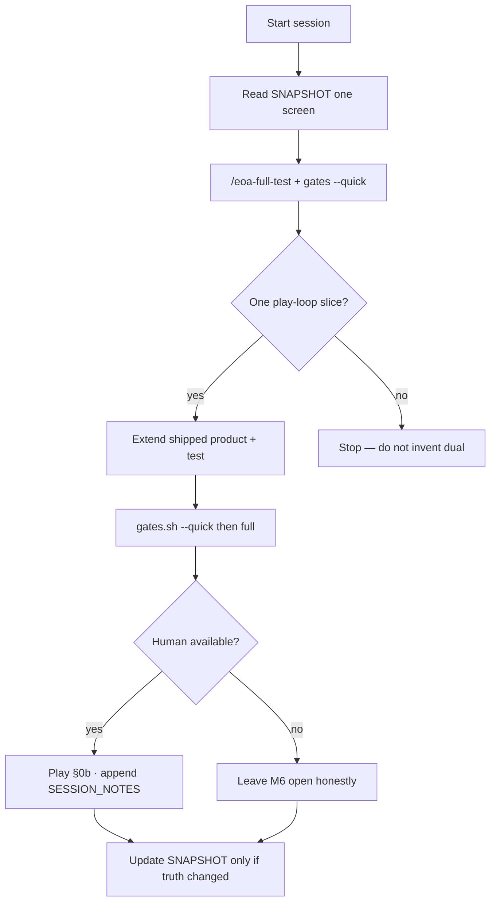
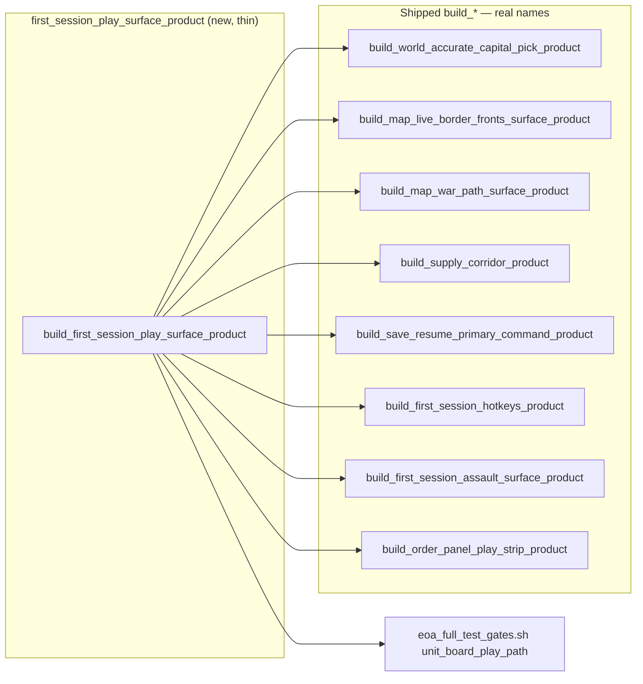
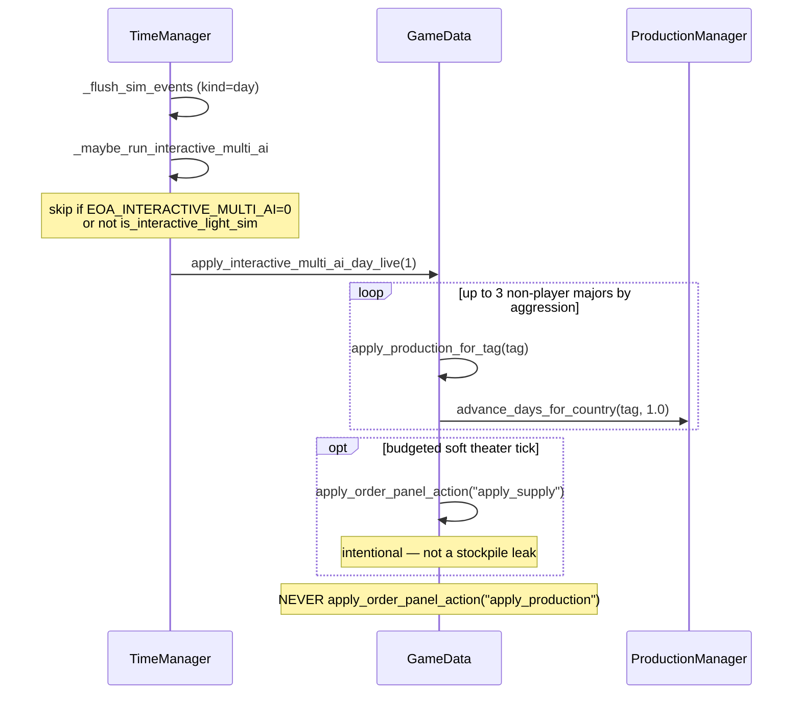

# Epochs of Ascendancy — Forward Program after Git/Doc Snapshot

| Field | Value |
|-------|-------|
| **Document** | Next-steps plan: player-visible loop honesty on `world_accurate` |
| **Author** | Grok Design (systems) |
| **Date** | 2026-08-12 |
| **Status** | Draft (rev 3 — composer save `all_majors_ok`; failed-execute busy-clear kept) |
| **Board** | Default F5 `world_accurate` **~3520** (land ~3180 + sea 340) |
| **Engine** | Godot **4.7.1** via `tools/run_godot.sh` |
| **Snapshot base** | `505d91d` — “snapshot: world_accurate ~3520 + full-test machine state” |
| **GitHub working tip** | **`origin/main` @ `51b52e1`** (keep-going PR 1–4 landed). Branch off `main`; PRs target `main`. |

**Archive (do not re-open PR 1–3):** this DAG landed 2026-08-12 (PR 1 `2b19597` · PR 2 `30910c2` greps green · PR 3 `7035837` · PR 4 `0b13284`). Live truth is [`GAME_STATUS_SNAPSHOT.md`](GAME_STATUS_SNAPSHOT.md) §0. Body below is the approved design as written, not a to-do list.

**Truth sources (read first):** [`docs/GAME_STATUS_SNAPSHOT.md`](docs/GAME_STATUS_SNAPSHOT.md) · [`docs/HOI4_EOA_GAP_REVIEW.md`](docs/HOI4_EOA_GAP_REVIEW.md) · [`docs/EOA_RESIDUAL_PRIORITY_BOARD.md`](docs/EOA_RESIDUAL_PRIORITY_BOARD.md) · [`docs/PLAYTEST_AND_DECISION_GUIDE.md`](docs/PLAYTEST_AND_DECISION_GUIDE.md) §0b · [`docs/SESSION_NOTES/2026-08-05_m6_smoke.md`](docs/SESSION_NOTES/2026-08-05_m6_smoke.md) · [`docs/GAME_DIRECTOR_PLAN.md`](docs/GAME_DIRECTOR_PLAN.md) · [`.grok/skills/eoa-full-test/SKILL.md`](.grok/skills/eoa-full-test/SKILL.md) · [`AGENTS.md`](AGENTS.md)

---

## Overview

Machine full-test is green. HOI open P0 = 0. The default board is `data/provinces_world_accurate/` **~3520**. Docs were reconciled to that scale on 2026-08-12. What is *not* true is that a human can sit down, F5, play GER, and have a machine that fails if the first-session surfaces regress as a set — or that the remaining B-hang *class* of bugs (deferred `show_info_panel` after assault execute; pin-click inspector storm; capture light-refresh that full-scans ~3520 fills **and rebuilds every unit pin**; BattleManager notify on `selected_province_id` not `target_pid`) is gated.

This program is four small, mergeable PRs: (1) a thin **§0b composer** that calls shipped `build_*` functions by their real signatures and extends `tools/eoa_full_test_gates.sh`; (2) **assault loop integrity** on the shipped Ctrl+click / play-strip path, including pid-scoped icons and BattleManager notify; (3) put **already-correct** tag-scoped multi-AI on the official gate and harden the TimeManager flush-site assertion (`apply_supply` soft tick stays); (4) a **keep-going director board** so the next session starts from SNAPSHOT, not June `origin/cursor/*` or in-flight `execute-plan/ceb60fdd-*`.

No new residual dual packages. No densify. No GameData mega-split. No M6-complete claim. No invented 30fps PASS. No merge of `ceb60fdd-*`. No corridor spiderweb PRs.

---

## Background & Motivation

### What landed on 2026-08-12

| Fact | Evidence |
|------|----------|
| Default board ~3520 | SNAPSHOT §1; `data/provinces_world_accurate/` (Europe NUTS 1514 + US 130 + RoW ~1536 + seas 340) |
| Dual scaffold intact | `EOA_SCENARIO=world_full` (~2665). **Never renumber those IDs.** |
| Map machine closed | M0–M5, A2/A2b, Phase C Fronts, Stream 2, WarLoop, Command Center save |
| HOI pillars | `hoi_full_test_gap_matrix_product` — 17/17 P0 landed, **open P0 = 0** |
| Residual machine items | Closed 2026-08-03 (play-strip, assault *discoverability*, personality multi-AI) |
| Soft 30fps | Honest FAIL — map-tick proxy mean **34.01 ms / ~29.4 fps** |
| M6 | Human 20d/60d narrative **still open** — not a machine gate |
| GitHub / local tip | `origin/main` @ `51b52e1` (on top of snapshot `505d91d`). Forward work branches from `main`. |
| Stale remotes **on this clone** | `origin/cursor/fix-void-return-2453` (June `origin/main`). Local `feature/goals-forward-2026-06-18`. **Do not merge** any `origin/cursor/*` or that June feature branch. `cursor/continue-infra-ai-combat-6057` is **not** in this clone’s refs. |
| In-flight Ladder A worktrees | `execute-plan/ceb60fdd-pr-1` … `pr-6` + `ceb60fdd-stack-assembly` already touch `MapRenderer.gd`. **Do not merge.** This DAG is the forward path (see Key Decision 8). |

### The real gap is loop honesty, not more pillars

Human §0b (`docs/SESSION_NOTES/2026-08-05_m6_smoke.md`) is incomplete: items **3–15 mostly blank**. Item 7 originally hung on **B**; that specific B path was fixed 2026-08-07 (single-pass / budgeted collect + cache + no inspector). The *class* of bug — post-action `show_info_panel` / full-board fill / full pin rebuild on a 3520-province map — is still on the assault *execute* path.

`MASTER_COMPLETION_PLAN.md` remains a long catalogue (stale 8761-line era in places; §1.0 still claims missing `historical_leaders_world_accurate.json` even though D1.1 is DONE). Do not treat it as the live board. SNAPSHOT + this file win.

A sibling draft, [`docs/DESIGN_LADDER_A_PLAY_BLOCKERS.md`](docs/DESIGN_LADDER_A_PLAY_BLOCKERS.md) (2026-08-11), covers corridor spiderweb, transit rights, exclave sea fallback, **and** a more complete assault hang list (pid-scoped icons, BM notify `target_pid`). That corridor/transit slice is **not** this DAG. This clone already has execute-plan branches for it:

- `execute-plan/ceb60fdd-pr-1-assault-hang-hard-fix-empty-tag-path-honesty`
- `execute-plan/ceb60fdd-pr-2-gf5-corridor-only-roads-f1-full-hide`
- `execute-plan/ceb60fdd-pr-3-player-tag-corridor-forced-sea-fallback-exclave`
- `execute-plan/ceb60fdd-pr-4-unit-pin-select-move-assault-loop-polish`
- `execute-plan/ceb60fdd-pr-5-warloop-surface-readability-optional`
- `execute-plan/ceb60fdd-pr-6-honesty-touch-snapshot-session-note-pointers`
- `execute-plan/ceb60fdd-stack-assembly`

**Abandon / rebase rule:** this DAG is the forward path. **Do not merge** any `ceb60fdd-*` onto `main` as this program’s PRs. PR 2 here **adopts** Ladder A PR 1’s hang sites (icons + BM notify `target_pid`) and **does not** take empty-tag supply / corridor work. `ceb60fdd-pr-1` is abandoned (hang fix lands here). Corridor PRs (`ceb60fdd-pr-2` / `pr-3`) stay parked; if the director later opens Ladder A, rebase those branches onto `main` **after** this PR 2 (same `MapRenderer.gd` functions). Do not start spiderweb/transit PRs in this DAG.

### Pain points (verified in code, not invented)

1. **No composite first-session smoke.** Gates already run capital / fronts / WarLoop / corridor / save. They do **not** run `test_first_session_hotkeys_product`, `test_first_session_assault_surface_product`, `test_order_panel_play_strip_product`, or `test_interactive_multi_ai_day_product`. There is no `first_session_play_surface_*` composer (grep: zero hits).
2. **Assault execute still storms fill + pins + (sometimes) the inspector.** `MapRenderer._try_execute_province_attack` (≈16442) still `call_deferred("show_info_panel", …)` after a successful execute. `_assault_execute_busy` is cleared on the same frame, before deferred UI. On capture, `BattleManager.execute_province_assault` already calls `_notify_map_refresh()` (BattleManager.gd ≈670 / ≈1289), which `call_deferred("refresh_after_capture_light", selected_province_id)` — **not** `target_pid`. MapRenderer then schedules a **second** `refresh_after_capture_light(target_pid)`. Each call still `call_deferred("_update_unit_icons_for_test")`, which clears every `DemoUnitIcon_*` and rebuilds from `LeaderManager.formations` + `SupplyManager.division_deployments` (≈20936–20968). `refresh_after_capture_light` (≈21506) also calls `_refresh_province_fill_colors(false)`, which on `board_n >= ACCURATE_BOARD_CULL_THRESHOLD` (3000) **always paints every province** (`use_all` at ≈18207–18211).
3. **Pin click opens the same inspector.** `_try_open_unit_at_world` (≈15628) already wins click priority, then calls `show_info_panel(p)`.
4. **Attack affordance hides instead of explaining — and only lives on the inspector.** `_btn_attack` is a child of `info_panel` (`_ensure_attack_button` ≈16560, initial `visible = false`). `_update_attack_button` (≈16583) is called only from `show_info_panel` (≈15499) and sets `_btn_attack.visible = can_attack`. There is no `disabled` property today. When staging is empty, the button vanishes. If pin-click stops opening the inspector, the button is not on screen after the natural staging action. Province left-click still opens the inspector (≈1275).
5. **Multi-AI tag-scope is already correct — and off the official gate.** Live path: `TimeManager._flush_sim_events` → `_maybe_run_interactive_multi_ai()` → `GameData.apply_interactive_multi_ai_day_live` → **`apply_production_for_tag`** for production. Unit tests already fail if the live body calls `apply_order_panel_action("apply_production")`. The same live body **does** call `apply_order_panel_action("apply_supply", province_id)` for the budgeted soft theater tick (≈26352–26354). That is **not** a stockpile leak. The product is **not** in `eoa_full_test_gates.sh`.
6. **Director board is one SNAPSHOT sentence + a 2026-08-03 residual table.** Sessions still risk merging June `origin/cursor/*` or `ceb60fdd-*`, or opening a new dual package.

---

## Goals & Non-Goals

### Goals

1. A **single machine proof** that first-session surfaces stay green together: capitals, Fronts/**B**, WarLoop/**Shift+I**, corridor/**G**, save **Ctrl+S/L**, hotkeys, play-strip Assault, assault toast. Fail if any shipped builder in the call table regresses.
2. A **B-hang-class regression** that would have caught deferred inspector / full-fill / full-pin storms on assault execute and pin select. Fix the shipped path (including BM notify pid + pid-scoped icons). The grep is red today on execute.
3. Official-gate coverage of **tag-scoped** interactive multi-AI. Close a stockpile leak **only if** a test proves one remains (current tests prove the production leak is closed). **Keep** the `apply_supply` soft tick.
4. A **keep-going board**: next human action, next machine action, deferred list, session protocol. Not the only PR.
5. 3–5 independently reviewable PRs, each closable in one implementer session, each vertical play-loop value.

### Non-goals (do not treat as gates; do not open PRs)

- M6 human 20d/60d narrative notes (human-only; never a machine PR that “completes M6”)
- Soft 30fps hard-pass / inventing PASS on ~29.4 fps map-tick proxy
- `GameData.gd` mega-split (MASTER Phase G0; ~43k lines — later phase)
- Densify / SE Asia micro-merge / museum borders / 13k provinces
- Multiplayer product, full V3 markets, commercial HOI designer UX, space depth
- New residual dual packages (`*_primary_live` markers, 5-step domains)
- GitHub SSH / `gh` auth (ops note in Rollout)
- Merging any `origin/cursor/*` (this clone has `origin/cursor/fix-void-return-2453`) or `feature/goals-forward-2026-06-18`
- Merging any `execute-plan/ceb60fdd-*` / `ceb60fdd-stack-assembly`
- Starting DESIGN_LADDER_A corridor spiderweb / transit / exclave-sea PRs
- Renumbering `world_full` IDs

---

## Proposed Design

### North star (unchanged)

A player can F5 `world_accurate`, pick **GER**, see capitals / Fronts / WarLoop / supply, produce → equip → stage → assault, save/load, and run 5–10 then 20–60 days without freeze. Machine gates already *claim* this. Human §0b is incomplete. This program makes the claim **fail-closed as a set** and removes the remaining hang-class on the shipped assault path.

### How to keep going (session protocol)

Every Cursor / Grok / human session on this tree:

1. **Read SNAPSHOT** (`docs/GAME_STATUS_SNAPSHOT.md`) — one screen. If this file disagrees with MASTER or TODO, SNAPSHOT wins.
2. **Load skill** `/eoa-full-test` (`.grok/skills/eoa-full-test/SKILL.md`). Run `tools/eoa_full_test_gates.sh --quick` before claiming done; full script before merge.
3. **One vertical play-loop slice per session.** Fix the shipped API. Extend the existing product/test. Do not open a new dual package.
4. **Human plays §0b** and **appends** `docs/SESSION_NOTES/` (do not invent M6 complete).
5. **Do not merge** `origin/cursor/*`, `feature/goals-forward-2026-06-18`, or `execute-plan/ceb60fdd-*`. Work from GitHub `main` (`51b52e1`+). Dual board only via `EOA_SCENARIO=world_full`. Godot only via `tools/run_godot.sh`.



### Shipped inventory (reuse — do not duplicate)

| §0b / loop surface | Control | Product / API | In `eoa_full_test_gates.sh` today? |
|--------------------|---------|---------------|-------------------------------------|
| Capitals (8 majors, 1936 owner==tag) | Click / pick harness | `world_accurate_capital_pick_product` · `tools/map_manager_pick_harness_accurate.gd` | **Yes** (`unit_board_play_path` + `launch_pick`) |
| Fronts | **B** / toolbar Fronts | `map_live_border_fronts_surface_product` · `MapManager.collect_live_border_assault_targets` · `MapRenderer.show_live_border_fronts` / `_run_live_border_fronts_instant` | **Yes** |
| WarLoop | **Shift+I** / toolbar | `map_war_path_surface_product` · `show_first_session_war_path` | **Yes** |
| Supply corridor | **G** | `map_supply_corridor_product` (`build_supply_corridor_product`) · `map_supply_hub_brief_product` (already gated; **not** in the composer eight-list) | **Yes** |
| Save / resume | **Ctrl+S / Ctrl+L** | `save_resume_primary_command_product` · `save_browser_campaign_product` · `TopInfoBar` `EOA_HOTKEY_CTRL_S` | **Yes** (`unit_save_path`) |
| Hotkeys / F5–F9 contract | Help / `?` | `first_session_hotkeys_product` · `TestRunner` `setup_solo_play("GER")` | **No** |
| Assault discoverability | Play-strip Assault · toast · Ctrl+click | `first_session_assault_surface_product` · `toast_assault_surface` · `apply_assault` | **No** |
| Play-strip membership | OrderCommandPanel player mode | `order_panel_play_strip_product` · `_rebuild_play_mode_strip` | **No** |
| Interactive multi-AI | F5 day flush | `interactive_multi_ai_day_product` · `apply_production_for_tag` · `ProductionManager.advance_days_for_country` | **No** |
| Multi-front assault execute | Headless | `HeadlessWorldAccurateMultiFrontAssaultTest.gd` | **Yes** (`launch_assault`) |
| Year multi-AI (separate path) | Headless 365d | `tools/eoa_year_multi_ai_test.sh` | Outside this gate script (keep intact) |

### Architecture: composer, not a new pillar



The composer is an orchestrator in the same style as `map_war_path_surface_product.build_map_war_path_surface_product`, which already imports and calls `build_map_live_border_fronts_surface_product`. It does **not** re-implement BFS, ownership, or toast strings. There is **no** `build_map_supply_corridor_product`.

Adding the four missing child tests to the gate already fail-closes those surfaces. The composer’s extra AND is for a **single named §0b `ok`**. It will re-parse some `provinces_world_accurate` JSON that sibling tests in the same `unittest` invocation already loaded — accepted (see Risks). Keep the existing gated tests; do not remove them.

**B-hang / execute hang greps live in one product only:** `first_session_assault_surface_product` (PR 2). The composer does **not** duplicate those greps.

### PR 1 — §0b machine proof

**New file:** `tools/map_generation/lib/first_session_play_surface_product.py`

Call **exactly** these builders (not `*_integrity` wrappers — those stay in the existing per-product tests). Composer child pass is `bool(p.get("ok"))` except **save** (see table). Composer `ok` is AND of those child-pass bits. **Do not** add an `ok` alias on the shipped save builder.

| Child key | Function (do not invent names) | Kwargs | Child-pass field |
|-----------|--------------------------------|--------|------------------|
| `capital_pick` | `build_world_accurate_capital_pick_product()` | defaults (no tag kwarg; already asserts 8 majors) | `p["ok"]` |
| `fronts` | `build_map_live_border_fronts_surface_product(...)` | `country_tag="GER"` | `p["ok"]` |
| `war_path` | `build_map_war_path_surface_product(...)` | `country_tag="GER"` | `p["ok"]` |
| `corridor` | `build_supply_corridor_product()` | defaults (no tag kwarg) | `p["ok"]` |
| `save` | `build_save_resume_primary_command_product(...)` | `province_id=1` | **`p["all_majors_ok"]`** and `int(p.get("dead_n") or 0) == 0` (builder has **no** `ok` key; existing test asserts `all_majors_ok`. `all_majors_ok` already implies `dead_n == 0` at 505d91d; still check both.) |
| `hotkeys` | `build_first_session_hotkeys_product(...)` | `player_tag="GER"` (not `country_tag`) | `p["ok"]` |
| `assault` | `build_first_session_assault_surface_product(...)` | `country_tag="GER"`, `check_wiring=True` | `p["ok"]` |
| `play_strip` | `build_order_panel_play_strip_product(...)` | `province_id=1` | `p["ok"]` |

Do **not** call `map_supply_hub_brief_product` here (already in `unit_board_play_path`). Do **not** add B-path `show_info_panel` greps here (PR 2 owns those on the assault product). Do **not** require a new Godot `-s` harness; existing `launch_pick` + `launch_assault` stay.

**Gate delta** (`tools/eoa_full_test_gates.sh` `unit_board_play_path`): add

```
tools.map_generation.tests.test_first_session_play_surface_product
tools.map_generation.tests.test_first_session_hotkeys_product
tools.map_generation.tests.test_first_session_assault_surface_product
tools.map_generation.tests.test_order_panel_play_strip_product
```

Keep existing capital / fronts / war-path / corridor / HOI / save steps.

**Test:** `tools/map_generation/tests/test_first_session_play_surface_product.py` calls the **real** `build_first_session_play_surface_product`. Asserts `ok`, that `children` has the eight keys above, and that `fail` is empty. After PR 2, a red hang-class on the assault child flips composer `ok` because assault `ok` becomes `len(fails)==0`.

### PR 2 — Assault loop integrity (hang class + Attack silence)

Discoverability is already shipped: `ASSAULT_STEPS`, `toast_assault_surface`, play-strip `[2] Assault` / `apply_assault`, Ctrl+click preview-then-confirm. Residual board row 3 is correctly “closed” for *discoverability*. The remaining hole is **integrity**. PR 4 must **not** write “hang-class closed” until the greps below are red-green.

**Must-fix on shipped path:**

| Site | Today | After |
|------|-------|-------|
| `MapRenderer._try_execute_province_attack` **success** (≈16541–16546) | `call_deferred("show_info_panel", provinces[target_pid])` then `_assault_execute_busy = false` on the same frame | Toast + `_center_camera_on_province` only. **No** `show_info_panel` on execute success. Schedule **one** named deferred `_assault_post_ui_light(target_pid, from_pid)` on **success only**. Do **not** clear busy in the success tail. |
| `MapRenderer._try_execute_province_attack` **failure** (≈16506–16509) | Synchronous `_assault_execute_busy = false` then return | **Keep** that synchronous clear. A failed execute must not wait for `_assault_post_ui_light` or every later assault toasts “Assault still resolving.” |
| `MapRenderer._assault_post_ui_light` (new) | — | Light UI: `_refresh_province_fill_pids([target, from])` + pid-scoped icon touch. Clear busy at end. No inspector. No `force_border_update`. **Success path only.** |
| `BattleManager._notify_map_refresh` (≈1289) | `refresh_after_capture_light(selected_province_id)` | Store last combat `target_pid` on the assault **result dict** (`target_province_id` already used elsewhere ≈1313). Pass **that** pid, not selection. |
| `MapRenderer.refresh_after_capture_light` (≈21506) | `_refresh_province_fill_colors(false)` → `use_all` on accurate board; `call_deferred("_update_unit_icons_for_test")` full rebuild | Recolor **only** the passed pids via `_refresh_province_fill_pids`. Update icons **only** for those pids (new helper, or skip icons if `_assault_post_ui_light` already did). Must **not** call `_refresh_province_fill_colors` or `_update_unit_icons_for_test` (full rebuild). Do not `force_border_update` (already forbidden at ≈16536). |
| `MapRenderer._try_open_unit_at_world` (≈15643) | `show_info_panel(p)` after pin select | Staging + toast already exist (`_select_map_unit`). **Do not** open inspector. **Do not** call `_update_attack_button` from pin-click (button lives on `info_panel`). |
| `MapRenderer._update_attack_button` (≈16583) | `visible = can_attack`; no `disabled` | **Only when `info_panel` is visible** on a **non-friendly** selected province: `visible = true`, `disabled = not can_attack`, `tooltip_text = preview.reason` or the existing “no friendly divs staged — move units first” string (≈16485). Play-strip Assault remains the OOB control. Province left-click still opens inspector (≈1275) — **not** in this must-fix table. |
| F10 `debug_stage_and_execute_sample_assault` (≈19263–19271) | `force_border_update` + `force_full_map_refresh` + `show_info_panel` | **Debug-only exception.** Integrity must not scan this function as the player execute path. Prefer pointing F10 at `_assault_post_ui_light` if cheap; not required for PR close. |

Empty-tag assault: `_player_tag()` empty already toasts “Set player country (TopInfoBar) before attacking.” Default F5 is `TestRunner` `setup_solo_play("GER")`. Do **not** open DESIGN_LADDER_A supply empty-tag / transit / corridor work here.

Optional: `HeadlessWorldAccurateAssaultEntryTest.gd` (GER 710173 → FRA 710739) double-execute wall-time ≤500 ms/execute (not an FPS claim). **Not** in `--quick`. Not required for PR close if source integrity is red-green.

**Source integrity** (extend `first_session_assault_surface_product` only — do not invent a second product, do not put these greps on the composer):

Today `ok` is only `"no_ctrl_click_hint" not in fails and "no_assault_word" not in fails`. Wiring keys go into `fail` but **do not** flip `ok`. `test_wiring_assault_hint` asserts a wiring dict key, not `p["ok"]`.

**After PR 2:** `ok = len(fails) == 0` when `check_wiring=True`. Hang-class keys (`execute_no_info_panel`, `execute_no_force_border`, `b_path_no_info_panel`, `capture_no_full_fill`, `capture_no_full_icons`, `notify_uses_target_pid`, `busy_clears_in_post_ui_light`) are hard fails.

Slice rules (no undefined `success_path()` helper):

1. **Player execute:** from the first identifier `execute_province_assault` inside `func _try_execute_province_attack` through the end of that function. Identifiers `show_info_panel` and `force_border_update` must **not** appear in that slice, **including comments**.
2. **B path:** slice `func _run_live_border_fronts_instant` (and `func show_live_border_fronts`) — no `show_info_panel` identifier, including comments.
3. **Capture light:** slice `func refresh_after_capture_light` — must not contain `_refresh_province_fill_colors` or `_update_unit_icons_for_test`.
4. **BM notify:** slice `func _notify_map_refresh` in `BattleManager.gd` — must pass a combat `target_pid` / `target_province_id` from the result, not only `selected_province_id`.
5. **Busy:** `_assault_execute_busy = false` **must** remain in the **failure** branch of `_try_execute_province_attack` (`not assault.success`). After a **successful** `execute_province_assault` in that function, `= false` must **not** appear — success clears only in `_assault_post_ui_light`. **Do not** grep the whole execute function for a missing `= false` (that would delete the failure clear).
6. **Do not** apply rules 1/5 to `debug_stage_and_execute_sample_assault` (F10 exception).

Unit test: `build_first_session_assault_surface_product(check_wiring=True)` → assert `p["ok"]` (false on HEAD today once hang-class keys are hard). After the GD fix, `ok` is true and `fail` is empty.

**Do not** claim M6 complete. Do not add a persistent OOB Attack chip (skeptic pass Challenge 2 — deferred).

### PR 3 — Interactive multi-AI / production tag-scope honesty

**Verified already shipped (do not re-implement):**



- `TimeManager.gd` ≈325: `_maybe_run_interactive_multi_ai()` inside `_flush_sim_events` day branch. Full `simulate_daily_ai_combat` stays behind `_should_run_daily_ai_combat()` → `not is_interactive_light_sim()`.
- `GameData.apply_production_for_tag` ≈4581: tag-scoped; does **not** call global `daily_production_tick`.
- `ProductionManager.advance_days_for_country` ≈332: only lines owned by `country_tag`; soft stock credit on empty lines.
- `interactive_multi_ai_day_product.simulate_tag_stockpile_applies` already proves `player_delta == 0` and fails a bare `apply_production` op.
- Live-body regex already forbids `apply_order_panel_action("apply_production")`.
- Live body **keeps** `apply_order_panel_action("apply_supply", province_id)` for the one soft theater tick.

**What this PR actually does** (the hole is gate coverage + flush-site tightness, not a new leak):

1. Add `tools.map_generation.tests.test_interactive_multi_ai_day_product` to `eoa_full_test_gates.sh` `unit_board_play_path` (append to the existing unit step so `--quick` stays one invocation).
2. Tighten `interactive_multi_ai_day_product` wiring: `TimeManager._flush_sim_events` body (not just the file) must contain `_maybe_run_interactive_multi_ai`. Today the product only checks that the symbol exists somewhere in the file (≈463–465).
3. GER-as-player sim: call `build_interactive_multi_ai_day_product(player_tag="GER")` (or `build_interactive_multi_ai_day_queue(..., player_tag="GER")` + `simulate_tag_stockpile_applies`). Assert **GER ∉ `prod_tags`** and **`player_delta == 0`**. The planner’s `DEFAULT_PLAYER_TAG = "USA"` stays; live GD must still read `get_player_country_tag` (already ≈26237) and skip `tag == player_tag` (already ≈26319).
4. Remaining-leak hunt is **only**: `daily_production_tick`, `apply_production(` that is **not** `apply_production_for_tag`, and `apply_order_panel_action("apply_production")` — the same regex the product already uses. **Do not** treat `apply_order_panel_action("apply_supply")` as a leak. **Do not invent a leak.** If those three needles are absent from the live multi-AI body, ship the tighter test and stop.

Killswitch `EOA_INTERACTIVE_MULTI_AI=0` and year-path isolation (`EOA_YEAR_MULTI_AI=1` skips interactive) stay as-is.

### PR 4 — Keep-going director board

Last PR. Short live-truth update, not a new manifesto.

**Edit (do not create a sixth long plan):**

| File | Change |
|------|--------|
| `docs/GAME_STATUS_SNAPSHOT.md` | Expand the “How to keep going” blurb into the 5-step session protocol. Record that §0b is machine-composited; M6 still human-only; multi-AI on official gates. Assault hang-class: write **closed only if** PR 2 hang-class greps are green (fill-pids, no full icon rebuild, BM notify `target_pid`, success-path busy clears in `_assault_post_ui_light`; failure still clears synchronously). Date stamp. |
| `docs/EOA_RESIDUAL_PRIORITY_BOARD.md` | Date → 2026-08-12. Add rows: §0b composer (closed by PR 1); assault hang-class (closed by PR 2 **iff** those greps pass); multi-AI on gates (closed by PR 3). Keep M6 **human-only**. Keep FPS / designer / SE Asia / museum **deferred**. Explicit: do not merge `origin/cursor/*`, `feature/goals-forward-2026-06-18`, or `execute-plan/ceb60fdd-*`. |
| `docs/SESSION_NOTES/2026-08-05_m6_smoke.md` | **One pointer paragraph only.** B hang fixed 2026-08-07; execute hang-class addressed in this DAG’s PR 2; items 3–15 still await human marks. **Do not fill M6 narrative. Do not “fix” the duplicate item 7 checklist row** as if a human replayed §0b. |
| `docs/GAME_DIRECTOR_PLAN.md` | One paragraph under Phase M6 / “next session”: this DAG, then human §0b. |

**Must state clearly:**

- **Next human action:** Launch `tools/run_godot.sh --path . res://scenes/TestScenario.tscn`, play PLAYTEST §0b items 3–15, append session notes. M6 20d/60d still open after that.
- **Next machine action (after this DAG):** Only a playtest-driven bug on a shipped path. No new dual. No GameData split. No `ceb60fdd-*` merge.
- **Deferred:** soft 30fps, `renderer_frame`, deeper fuel network, designer UX, multi-month personality depth, SE Asia merge, museum/13k/MP/V3, DESIGN_LADDER_A spiderweb/transit (`ceb60fdd-pr-2` / `pr-3` stay parked).
- **Session start:** `/eoa-full-test` · `tools/eoa_full_test_gates.sh --quick` · GitHub `main` (`51b52e1`+).

### Optional 5th PR — skipped

| Candidate | Verdict |
|-----------|---------|
| 1936 ownership / capital click honesty | **Already gated.** `world_accurate_capital_pick_product` fails if any of GER/FRA/ENG/USA/SOV/ITA/JAP/POL has `owner != tag`, water capital, or missing geo. `map_manager_pick_harness_accurate.gd` is a full-gate headless step. Human click checklist is still recommended — not a machine hole. |
| Unit pin select loop | Click order is already unit-first (≈1222). Chrome / LOD copy is DESIGN_LADDER_A PR4 (`ceb60fdd-pr-4`) — parked. The **hang-class** part (inspector on pin click) is folded into **this** PR 2. No separate PR. |

No 5th PR.

---

## API / Interface Changes

### New (PR 1 only)

```python
# tools/map_generation/lib/first_session_play_surface_product.py

def build_first_session_play_surface_product(*, country_tag: str = "GER") -> dict:
    """Call the eight shipped build_* functions in the call table. ok iff all child ok."""
    ...

def first_session_play_surface_integrity(**kwargs) -> dict:
    ...
```

`country_tag` is forwarded **only** to children that accept `country_tag` or `player_tag` (see call table). Other children are called with defaults. Return shape: `ok`, `status`, `pass`, `fail`, `summary`, `children: {key: {ok, summary}}`. Child `ok` for save is `bool(p.get("all_majors_ok")) and int(p.get("dead_n") or 0) == 0` — **not** `p.get("ok")`. Do not invent an `ok` key on `build_save_resume_primary_command_product`.

### Extended (PR 2)

`first_session_assault_surface_product.build_first_session_assault_surface_product`:

- New wiring keys listed under PR 2 source integrity.
- When `check_wiring=True`: **`ok = len(fails) == 0`** (today `ok` ignores wiring/`fail`).
- Hang-class slice rules as specified (execute slice from `execute_province_assault` to function end; identifiers including comments).

Godot (behavioral, no new autoloads):

| Symbol | Change |
|--------|--------|
| `MapRenderer._try_execute_province_attack` | No `show_info_panel` / `force_border_update` after **successful** `execute_province_assault`; defer `_assault_post_ui_light` on success only; **keep** synchronous `_assault_execute_busy = false` on failure |
| `MapRenderer._assault_post_ui_light(target_pid, from_pid)` | New; **success-path** busy-clear only |
| `MapRenderer._refresh_province_fill_pids(pids: Array)` | New; accurate-board capture recolor |
| `MapRenderer._update_unit_icons_for_pids(pids: Array)` (or equivalent) | New; no full `_update_unit_icons_for_test` on capture |
| `MapRenderer.refresh_after_capture_light` | Fill-pids + pid icons only |
| `BattleManager._notify_map_refresh` | Pass combat `target_pid` from result dict |
| `MapRenderer._try_open_unit_at_world` | No full inspector; no `_update_attack_button` |
| `MapRenderer._update_attack_button` | If inspector visible on non-friendly: `visible=true`, `disabled=not can_attack`, tooltip = reason |

No `EOA_ASSAULT_OPEN_INSPECTOR` env flag.

### Extended (PR 3)

`interactive_multi_ai_day_product` wiring: require `_maybe_run_interactive_multi_ai` inside `_flush_sim_events` slice; GER-as-player stock sim (`GER ∉ prod_tags`, `player_delta == 0`). Leak hunt needles listed in PR 3. `apply_supply` soft tick unchanged. No new GameData methods.

### Unchanged

- `GameData.apply_production_for_tag` / `apply_interactive_multi_ai_day_live` (except PR 3 tests)
- `ProductionManager.advance_days_for_country`
- `MapManager.collect_live_border_assault_targets` (already budgeted + cached)
- SaveLoadManager / Command Center Ctrl+S/L
- Dual `world_full` IDs

---

## Data Model Changes

**None.** No province JSON rewrite. No save-schema migration. No ownership remap.

Runtime-only: `_assault_execute_busy` lifetime; `_assault_post_ui_light`; `_refresh_province_fill_pids`; pid-scoped icon helper; Attack button `disabled` vs `visible`; BattleManager result `target_province_id` plumbed into notify.

1918 / 2026 scenarios (`data/scenarios/1918.json`, `2026.json`) stay selectable via `EOA_SCENARIO` but are **out of this DAG**. Default remains 1936-ownership `world_accurate`.

---

## Alternatives Considered

### A. New headless UI-smoke Godot scene that “presses” B / Shift+I / G

**Pros:** Closer to human §0b.  
**Cons:** Heavy, flaky under `--headless` without a display; duplicates `launch_pick` + `launch_assault`; high chance of a new dual-shaped harness.  
**Decision:** Reject as the primary gate. Composer + existing headless pick/assault is enough. Revisit only if a human §0b fail is invisible to source integrity.

### B. Claim residual board “closed” and only write docs

**Pros:** Fast.  
**Cons:** Skeptic pass already warned: assault “closed” if only toast; personality “closed” if not on the live day path; play-strip “closed” if debug Godot still looks like QA. Gates do not run the first-session / multi-AI tests today. Execute path still storms fill/pins/inspector.  
**Decision:** Reject. Docs are PR 4, last.

### C. Absorb DESIGN_LADDER_A (spiderweb / transit / exclave sea) into this DAG — or merge `ceb60fdd-*`

**Pros:** Real play blockers on G/F5; hang sites already sketched on those branches.  
**Cons:** Different program; two execute-plans on one `MapRenderer.gd`. User constraint: this DAG is loop honesty after the snapshot.  
**Decision:** **This DAG is the forward path.** Adopt Ladder A PR 1 hang sites (icons + BM notify) **into this PR 2**. **Do not merge** `ceb60fdd-*`. **Do not start** corridor spiderweb PRs. Park `ceb60fdd-pr-2` / `pr-3`; rebase later if director opens that slice.

### D. Start `GameData.gd` split (MASTER G0) so multi-AI lives in a small file

**Pros:** 43k-line file is a tax.  
**Cons:** Explicitly forbidden this cycle unless a tiny extract is required for a play-loop bug. It is not required.  
**Decision:** Reject.

### E. Gate-only — append the four existing unittests; no composer file

**Pros:** Cheaper; `--quick` already fail-closes those tests; avoids duplicate board JSON loads; B-hang greps can live solely on the assault product (PR 2 already adds that test to the gate via PR 1).  
**Cons:** No single named §0b `ok` the director asked for (“a single … smoke that fails if first-session surfaces regress”).  
**Decision:** Reject as the *only* deliverable. Keep the thin composer **and** add the child tests to the gate (gates grow, do not shrink). Accept duplicate JSON loads. Hang-class greps stay on the assault product only.

---

## Security & Privacy Considerations

Single-player, offline, no network auth.

| Threat | Mitigation |
|--------|------------|
| Save path traversal via slot names | Unchanged — `SaveLoadManager` existing sanitization. This DAG does not touch slot I/O. |
| Env killswitches (`EOA_INTERACTIVE_MULTI_AI=0`) | Documented; default ON for graphical F5. Do not disable in gates. |
| Dual-board ID corruption | No writes to `world_full` province IDs. |
| Accidental GitHub credential work | Push remains an ops task; no secrets in PRs. |

---

## Observability

| Signal | How |
|--------|-----|
| §0b composer | `summary` + `children.*.ok` printed by unittest `-v` |
| B / WarLoop / G | Existing toasts (`DebugOverlay.toast_map_debug` + `LeaderEventUI.show_toast`) |
| Assault preview / execute | Existing preview toast; execute toast via `_MapNextListHelpers.format_capture_assault_flair`. No inspector dump. |
| Hang class | Source integrity fail in **`test_first_session_assault_surface_product` only** (not duplicated on the composer) |
| Multi-AI day | `peace_state["production_last_tag_apply"]` already written by `apply_production_for_tag`; queue items carry `scoped_tag` + `aggression`; soft tick remains `apply_supply` |
| Gates | `tools/eoa_full_test_gates.sh` / `--quick` / `--log DIR` |
| Soft FPS | Still **not** a hard gate. `--with-perf` remains evidence-only. |

Do **not** invent FPS PASS. Do not add `*_primary_live=1` console markers.

---

## Rollout Plan

1. Linear stack **for execute-plan worktree simplicity** (not because `--quick` requires it): PR 1 → PR 2 → PR 3 → PR 4.
2. No feature flags. Existing killswitch `EOA_INTERACTIVE_MULTI_AI=0` stays. **No** `EOA_ASSAULT_OPEN_INSPECTOR` (F10 sample assault remains the debug exception).
3. Each PR: `tools/eoa_full_test_gates.sh --quick` green; full script before merge. Optional assault wall-time headless is **not** in `--quick`.
4. Rollback = revert that PR. Composer is additive; assault UI change is MapRenderer + BattleManager only.
5. **GitHub `main`** is the working tip (`51b52e1`+). Branch → PR → merge to `main`. Never force-push over June Cursor history or `ceb60fdd-*`.
6. Human: after PR 2, re-run §0b items 7, 11, 14 (B, assault, 5–10 days). Append session notes. M6 remains open.

```
tools/run_godot.sh --path . res://scenes/TestScenario.tscn
[ ] F5 world_accurate ~3520 · GER · Home = Europe
[ ] B cycles Fronts · no freeze
[ ] Shift+I WarLoop toast
[ ] G corridor
[ ] Pin or province stage · Ctrl+click preview · second click execute · unpause <1s
[ ] Inspector open on enemy province: Attack visible; disabled + reason if unstaged
[ ] Play-strip Assault still the OOB control
[ ] Ctrl+S / Ctrl+L
[ ] Advance 5–10 days · no freeze · AI majors do not inflate player stockpile
[ ] tools/eoa_full_test_gates.sh --quick
```

---

## Open Questions

1. **Director:** After this DAG, is DESIGN_LADDER_A corridor/transit (`ceb60fdd-pr-2` / `pr-3`, rebased after this PR 2) the next machine slice, or does human §0b come first? Recommendation: **human §0b first**.
2. **Attack button placement:** **Decided.** Inspector-only (`info_panel` visible on non-friendly). Play-strip Assault stays the OOB control. Do not drive `_update_attack_button` from pin-click.
3. **Pin chrome** (scale/ring on `DemoUnitIcon_*`): skip unless human notes demand it after PR 2 (`ceb60fdd-pr-4` stays parked).

Nothing here blocks execute-plan.

---

## References

- `docs/GAME_STATUS_SNAPSHOT.md` (2026-08-12)
- `docs/HOI4_EOA_GAP_REVIEW.md` — open P0 = 0
- `docs/EOA_RESIDUAL_PRIORITY_BOARD.md` (2026-08-03; updated in PR 4)
- `docs/EOA_SKEPTIC_PASS_2026_08_03.md` — Challenge 2 (toast ≠ guaranteed Attack), 3b (tag-scope leak, fixed)
- `docs/PLAYTEST_AND_DECISION_GUIDE.md` §0b
- `docs/SESSION_NOTES/2026-08-05_m6_smoke.md`
- `docs/GAME_DIRECTOR_PLAN.md` phases D/M
- `docs/MASTER_COMPLETION_PLAN.md` — catalogue only
- `docs/DESIGN_LADDER_A_PLAY_BLOCKERS.md` — sibling slice; `ceb60fdd-*` parked
- `docs/EOA_GROK_SETUP.md` · `.grok/skills/eoa-full-test/SKILL.md` · `AGENTS.md`
- `tools/eoa_full_test_gates.sh`
- Products: `tools/map_generation/lib/{world_accurate_capital_pick,map_live_border_fronts_surface,map_war_path_surface,map_supply_corridor,map_supply_hub_brief,save_resume_primary_command,first_session_hotkeys,first_session_assault_surface,order_panel_play_strip,interactive_multi_ai_day}_product.py`
- Live: `scripts/map/MapRenderer.gd`, `scripts/map/MapManager.gd`, `scripts/combat/BattleManager.gd`, `scripts/autoload/{GameData,TimeManager,ProductionManager}.gd`, `scripts/ui/OrderCommandPanel.gd`, `scripts/ui/TopInfoBar.gd`, `scripts/core/TestRunner.gd`

---

## Key Decisions

1. **Composer, not a new dual / not a new Godot scene.** One pure orchestrator calls the eight shipped `build_*` functions in the call table. Pattern already used by `map_war_path_surface_product`. Avoids residual-package spam and headless UI flake. Duplicate board JSON loads vs sibling gate tests are accepted.

2. **Gates grow; they do not shrink.** Adding first-session + multi-AI tests to `eoa_full_test_gates.sh` is the official bar. Existing capital / fronts / WarLoop / corridor / save / HOI / pick / assault steps stay. Composer AND is extra, not a replacement.

3. **Assault “closed” on the residual board meant discoverability.** The remaining work is hang-class integrity: no `show_info_panel` after **successful** execute, pid-only fill, **pid-scoped icons** (no `_update_unit_icons_for_test` on capture), **BattleManager notify uses `target_pid`**, success-path busy clears only in `_assault_post_ui_light` (failure still clears synchronously), plus Attack button silence on the inspector. That is PR 2. PR 4 may write “closed” only when those greps are green.

4. **Do not re-fix multi-AI production scoping.** Live path already uses `apply_production_for_tag`. PR 3 is gate + flush-site assertion + GER-as-player sim. Inventing a second apply API would be dual spam.

5. **No 5th PARTIAL.** 1936 capital ownership is already a hard fail in `world_accurate_capital_pick_product`. Pin chrome is not proven; pin *inspector storm* rides with PR 2.

6. **M6 stays human-only.** No PR title or test name may say “complete M6”. Session notes stay blank until a human plays. PR 4 adds **one pointer paragraph** only.

7. **Soft 30fps stays FAIL honest.** ~29.4 fps map-tick proxy is not this program.

8. **This DAG is the forward path vs Ladder A execute-plan branches.** Expand PR 2 with the hang sites Ladder A already named (icons + BM notify `target_pid`). **Do not merge** `execute-plan/ceb60fdd-pr-1` … `pr-6` or `ceb60fdd-stack-assembly`. **Do not start** corridor spiderweb / transit / exclave-sea PRs. Abandon `ceb60fdd-pr-1` (hang fix lands here). Park `ceb60fdd-pr-2` / `pr-3`; rebase onto `main` only after this PR 2 if the director later opens that slice. Do not start a GameData split or densify.

9. **Do not merge June Cursor / old feature branches that exist on this clone.** List `origin/cursor/fix-void-return-2453` and `feature/goals-forward-2026-06-18`. Do not name `cursor/continue-infra-ai-combat-6057` as present — it is not in this clone’s refs. Broader rule: do not merge any `origin/cursor/*`. GitHub SSH is ops.

10. **Default player is GER on F5** (`TestRunner.setup_solo_play("GER")`). Composer forwards `player_tag="GER"` / `country_tag="GER"` only to children that accept those kwargs. Multi-AI planner may keep `DEFAULT_PLAYER_TAG = "USA"`; live code must honor `LeaderManager` (already does). GER-as-player sim asserts GER ∉ `prod_tags`.

11. **Accurate-board fill is never “lazy” today.** `_refresh_province_fill_colors` forces `use_all` when `board_n ≥ 3000`. Therefore `refresh_after_capture_light(..., false)` is a full 3520-poly scan. PR 2 must use a pid-list helper **and** must not full-rebuild pins.

12. **Linear PR stack for execute-plan worktree simplicity**, not because `--quick` coverage requires it. PR 1 already adds `test_first_session_assault_surface_product` to the gate; PR 2 extends that same product. PR 3 could land beside PR 1. We still stack PR 2 → PR 3 → PR 4 so worktrees stay one-at-a-time.

13. **`apply_supply` soft tick stays.** Leak hunt must not rip out `apply_order_panel_action("apply_supply")`. Needles are `daily_production_tick`, bare `apply_production(`, and `apply_order_panel_action("apply_production")` only.

14. **Hang-class greps live on `first_session_assault_surface_product` only.** Composer does not duplicate B-path greps. Assault `ok` becomes `len(fails)==0` so a red hang-class fails both the child test and the composer.

15. **No `EOA_ASSAULT_OPEN_INSPECTOR` flag.** F10 `debug_stage_and_execute_sample_assault` is the explicit debug exception.

---

## Risks

| Risk | Sev | Mitigation |
|------|-----|------------|
| Composer becomes a new dual-shaped product with its own “live” apply | High | No GameData method, no OrderCommandPanel button, no `*_primary_live`. Pure orchestrator + unittest only. |
| Removing `show_info_panel` after assault hides capture feedback | Med | Toast + flair already exist; preview toast already carries odds. Keep those. |
| `_refresh_province_fill_pids` misses a caller that still full-scans or full-rebuilds pins | High | Integrity: `refresh_after_capture_light` must not contain `_refresh_province_fill_colors` or `_update_unit_icons_for_test`; BM notify must pass `target_pid`. |
| Two execute-plans collide on `MapRenderer.gd` | High | Do not merge `ceb60fdd-*`. This PR 2 owns hang sites. |
| `--quick` re-parses board JSON (composer + sibling tests) | Low | Accepted. Do not remove existing gated tests. Integrity wrappers not required in the composer. |
| Over-claim “loop proven” / “hang-class closed” without greps or human §0b | High | PR 4 may write hang-class closed only if PR 2 greps are green; M6 remains open. |
| Implementer “fixes” `apply_supply` as a leak | High | PR 3 hunt needles are explicit; soft tick stays. |
| Implementer merges `origin/cursor/*` or `ceb60fdd-*` | High | PR 4 + SNAPSHOT + AGENTS: do not merge. |

---

## PR Plan

### PR 1: §0b first-session surface machine proof
- **Files/components affected:** `tools/map_generation/lib/first_session_play_surface_product.py` (new orchestrator), `tools/map_generation/tests/test_first_session_play_surface_product.py` (new), `tools/eoa_full_test_gates.sh` (`unit_board_play_path` adds composer + `test_first_session_hotkeys_product` + `test_first_session_assault_surface_product` + `test_order_panel_play_strip_product`)
- **Dependencies:** None
- **Description:** Thin pure composer that calls the **real** shipped builders with the call-table signatures: `build_world_accurate_capital_pick_product()`; `build_map_live_border_fronts_surface_product(country_tag="GER")`; `build_map_war_path_surface_product(country_tag="GER")`; `build_supply_corridor_product()` (there is no `build_map_supply_corridor_product`); `build_save_resume_primary_command_product(province_id=1)`; `build_first_session_hotkeys_product(player_tag="GER")`; `build_first_session_assault_surface_product(country_tag="GER", check_wiring=True)`; `build_order_panel_play_strip_product(province_id=1)`. Composer `ok` is AND of each child’s pass bit. **Save special case:** that builder has **no** `ok` key — use `all_majors_ok` and `dead_n == 0` (same as `test_save_resume_primary_command_product`). Do **not** invent an `ok` alias on the shipped save builder. Other children use `p["ok"]`. No `*_integrity` wrappers. Do not call `map_supply_hub_brief_product` (already gated). Do not add B-hang greps here (PR 2 owns them on the assault product). Extend `eoa_full_test_gates.sh` so `--quick` also runs the four previously omitted child tests. Do not add a new Godot scene, dual marker, or duplicate BFS/toast logic. Existing `launch_pick` / `launch_assault` headless steps stay. Accept duplicate board JSON loads.

### PR 2: Assault hang-class loop integrity
- **Files/components affected:** `scripts/map/MapRenderer.gd` (`_try_execute_province_attack`, new `_assault_post_ui_light`, `refresh_after_capture_light`, new `_refresh_province_fill_pids`, pid-scoped icon helper, `_try_open_unit_at_world`, `_update_attack_button`, `_assault_execute_busy` lifetime), `scripts/combat/BattleManager.gd` (`_notify_map_refresh` passes combat `target_pid` from the result dict), `tools/map_generation/lib/first_session_assault_surface_product.py` (hang-class keys; `ok = len(fails) == 0` when `check_wiring=True`), `tools/map_generation/tests/test_first_session_assault_surface_product.py`, optionally `scripts/core/HeadlessWorldAccurateAssaultEntryTest.gd` (double-execute wall-time, **not** in `--quick`, not FPS)
- **Dependencies:** PR 1
- **Description:** Discoverability is already wired (`toast_assault_surface`, play-strip `apply_assault`, Ctrl+click preview). Close the remaining hang class: after **successful** `BattleManager.execute_province_assault`, do **not** `call_deferred("show_info_panel")`; schedule deferred `_assault_post_ui_light` on **success only** (that is the success-path busy-clear). **Keep** the existing synchronous `_assault_execute_busy = false` on failed execute (≈16506–16509). Do **not** grep the whole execute function for a missing `= false`. Recolor only captured/from pids (must not call `_refresh_province_fill_colors` on accurate board — that path `use_all` at n≥3000); **do not** full-rebuild pins via `_update_unit_icons_for_test` on capture (pid-scoped helper); `BattleManager._notify_map_refresh` must pass **target_pid**, not `selected_province_id`; pin select must not open inspector or call `_update_attack_button`; when `info_panel` is visible on a non-friendly province, Attack stays visible and `disabled` with `can_assault` reason (play-strip Assault remains OOB). Source integrity (assault product only): slice `_try_execute_province_attack` from `execute_province_assault` to function end — identifiers `show_info_panel` / `force_border_update` must not appear **including comments**; same for B instant path `show_info_panel`; `refresh_after_capture_light` must not contain `_refresh_province_fill_colors` or `_update_unit_icons_for_test`. F10 `debug_stage_and_execute_sample_assault` is an explicit debug-only exception. Do not claim M6. Do not add a persistent OOB Attack chip. Do not merge `ceb60fdd-*`.

### PR 3: Interactive multi-AI tag-scope on the official gate
- **Files/components affected:** `tools/eoa_full_test_gates.sh` (add `test_interactive_multi_ai_day_product`), `tools/map_generation/lib/interactive_multi_ai_day_product.py` (flush-site slice + GER-as-player sim), `tools/map_generation/tests/test_interactive_multi_ai_day_product.py`
- **Dependencies:** PR 2
- **Description:** Live day path is already correct: `TimeManager._flush_sim_events` → `_maybe_run_interactive_multi_ai` → `GameData.apply_interactive_multi_ai_day_live` → `apply_production_for_tag` → `ProductionManager.advance_days_for_country`. Existing tests already forbid `apply_order_panel_action("apply_production")` and prove `player_delta == 0`. The live body **keeps** `apply_order_panel_action("apply_supply")` for the budgeted soft theater tick — that is not a leak. This PR puts the suite on `eoa_full_test_gates.sh --quick`, requires `_maybe_run_interactive_multi_ai` inside the `_flush_sim_events` body, and adds `build_interactive_multi_ai_day_product(player_tag="GER")` asserting GER ∉ `prod_tags` and `player_delta == 0`. Remaining-leak hunt needles only: `daily_production_tick`, `apply_production(` that is not `_for_tag`, and `apply_order_panel_action("apply_production")`. Do not invent a leak. Do not add a new apply API or dual. Killswitch and year-multi-AI isolation stay.

### PR 4: Keep-going director board
- **Files/components affected:** `docs/GAME_STATUS_SNAPSHOT.md`, `docs/EOA_RESIDUAL_PRIORITY_BOARD.md`, `docs/GAME_DIRECTOR_PLAN.md`, `docs/SESSION_NOTES/2026-08-05_m6_smoke.md` (one pointer paragraph only)
- **Dependencies:** PR 3
- **Description:** Write the live keep-going board: 5-step session protocol (SNAPSHOT → `/eoa-full-test` → `gates.sh --quick` → one play-loop slice → human §0b notes); next human action (`tools/run_godot.sh --path . res://scenes/TestScenario.tscn`, play §0b items 3–15); next machine action (playtest-driven shipped-path fix only); deferred list (M6 human, FPS, GameData split, densify, DESIGN_LADDER_A corridor/transit, museum/MP/V3). **Do not merge** `origin/cursor/*` (this clone has `fix-void-return-2453`), `feature/goals-forward-2026-06-18`, or `execute-plan/ceb60fdd-*`. GitHub push is ops. Mark PR 1–3 rows on the residual board; write assault hang-class **closed only if** PR 2 greps are green. Session note: one pointer; do not fill M6 narrative; do not rewrite the duplicate item 7 checklist as a human replay. Do not treat this as the only PR in the DAG.
