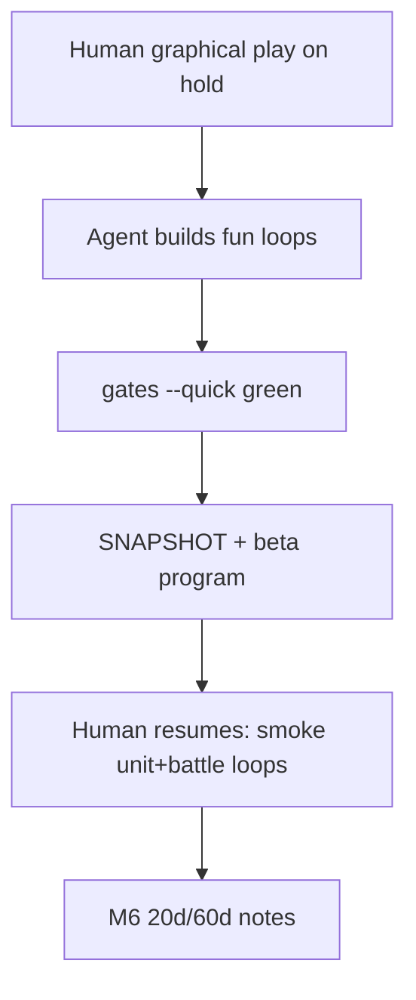

# EOA — Beta machine push (human playtest on hold)

| Field | Value |
|-------|-------|
| **Date** | 2026-08-16 |
| **Status** | Active while director PC / graphical play is unavailable |
| **Board** | `world_accurate` ~3520 |
| **Launch bar** | Toward **L2 Early Access / beta** via machine-proven fun loops |
| **Prior** | L1 unit war loop [`FORWARD_PROGRAM_L1_UNIT_WAR_LOOP.md`](FORWARD_PROGRAM_L1_UNIT_WAR_LOOP.md) |

**Truth:** [`GAME_STATUS_SNAPSHOT.md`](GAME_STATUS_SNAPSHOT.md) · launch [`LAUNCH_READINESS_PLAN.md`](LAUNCH_READINESS_PLAN.md)

---

## Protocol while playtests are paused

1. Do **not** invent M6 / §0b complete — human notes stay **open**.
2. Prefer **one vertical fun loop** per session: units on map, battle feel, reinforce, AI pressure.
3. Pure product + unit test + `eoa_full_test_gates.sh --quick` before claiming.
4. No new dual packages · no GameData mega-split · no `ceb60fdd-*` · never renumber `world_full`.

---

## Fun-loop backlog (ordered)

| # | Slice | Player feel | Gate |
|---|-------|-------------|------|
| **B1** | **Live multi-day battle feedback** | Day toast · open unit card org/str refresh · pin combat chrome | `multi_day_battle_product` · **landed this branch** |
| B2 | Unit-card stockpile reinforce | “Top up this division” without F10 | `unit_centric_pick_product` + PM APIs |
| B3 | AI border pressure (budgeted assaults) | Living front vs Maginot | extend interactive multi-AI / assault |
| B4 | Stack join into engaging battle | 2nd division reinforces fight | `multi_day_battle_product` (higher risk) |
| B5 | L1 ship kit docs | README play path + known issues | docs only |

**This session:** **B1**.

---

## Questions for director (answer when convenient — work continues)

1. **Beta nation focus:** GER Maginot only for first beta slice, or also FRA/SOV/JAP?
2. **Tone:** Prefer HOI-serious counters, or slightly more arcade feedback (stronger flashes/toasts)?
3. **AI aggression:** When B3 opens, should AI majors auto-assault adjacent player borders in peacetime 1936, or only after war goals / focus?
4. **Scope of beta:** Friend-play Alpha (L1) first, or jump straight at Early Access feel (L2 events/peace)?

Defaults if unanswered: **GER Maginot · HOI-serious with readable toasts · AI assaults only when at war · finish L1 machine loops then L2.**

---

## B1 exit criteria

- `flash_battle_day` surfaces day + att/def org from `last_slice` (toast, budgeted)
- Open `UnitDetailPopup` refreshes org/str while selected unit is engaging
- Pins show temporary combat chrome during battle; cleared on `battle_resolved`
- Maginot pure math still day 5–8 capture; `--quick` green
- Docs do **not** claim human M6 complete
