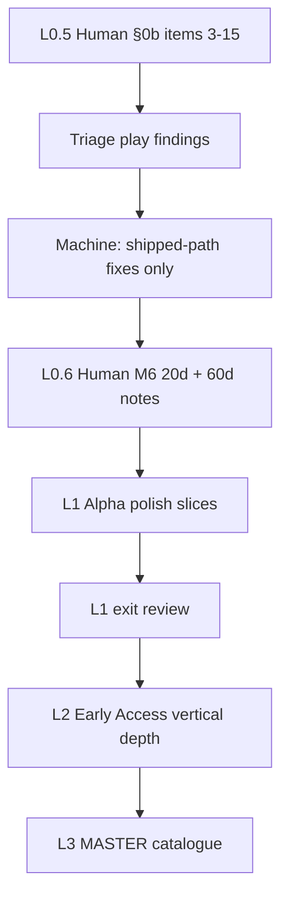

# EOA — Launch Readiness Plan

**Date:** 2026-08-16  
**Audience:** Director, playtester, implementer agents  
**Status truth:** [`GAME_STATUS_SNAPSHOT.md`](GAME_STATUS_SNAPSHOT.md) wins if this file disagrees  
**Orchestration:** [`GAME_DIRECTOR_PLAN.md`](GAME_DIRECTOR_PLAN.md) · residual [`EOA_RESIDUAL_PRIORITY_BOARD.md`](EOA_RESIDUAL_PRIORITY_BOARD.md)  
**Long catalogue (not the live board):** [`MASTER_COMPLETION_PLAN.md`](MASTER_COMPLETION_PLAN.md)  
**Human play:** [`PLAYTEST_AND_DECISION_GUIDE.md`](PLAYTEST_AND_DECISION_GUIDE.md) §0b  
**Gates:** `tools/eoa_full_test_gates.sh` · skill `eoa-full-test`

---

## 0. Verdict (one screen)

| Layer | State |
|-------|--------|
| **Machine full-test** | **Green** — map M0–M5 closed · HOI open P0 = 0 · year multi-AI 365d PASS · first-session composer + assault hang-class + multi-AI on official gates |
| **L1 unit war loop (machine)** | **Landed on forward branch** — pin pick · Maginot reserve · honest assault · march · multi-day battle · unit card · see [`FORWARD_PROGRAM_L1_UNIT_WAR_LOOP.md`](FORWARD_PROGRAM_L1_UNIT_WAR_LOOP.md) |
| **Human full-test proof** | **Incomplete** — §0b items 3–15 mostly blank · M6 20d/60d narrative **still open** |
| **Launch** | **L1 machine ready · human proof paused · beta machine push active** — see [`FORWARD_PROGRAM_BETA_MACHINE_PUSH.md`](FORWARD_PROGRAM_BETA_MACHINE_PUSH.md) |

**What moves the needle now:** while graphical play is on hold, agents ship fun unit/battle loops (B1 live feedback → B2 reinforce → B3 AI pressure). Do **not** invent M6 complete. Do **not** open new dual packages, densify, GameData mega-split, multiplayer product, museum borders, or invent a 30fps PASS.

---

## 1. What “launch” means (three bars)

EOA is a deep sandbox. “Launch” is phased; each bar has hard exits. Do not claim a higher bar when a lower one is open.

### Bar L0 — Full-test ready *(machine closed; human open)*

Already the director north star. Machine exits largely met.

| # | Exit | Owner | State |
|---|------|-------|--------|
| L0.1 | F5 `world_accurate` ~3520, SCRIPT ERROR 0 | Machine | **Met** |
| L0.2 | Map QC + unit + pick/assault gates green | Machine | **Met** |
| L0.3 | Produce → equip → stage → assault on accurate IDs | Machine | **Met** |
| L0.4 | Mapmodes / Fronts / WarLoop / G / save surfaces gated as a set | Machine | **Met** (§0b composer) |
| L0.5 | Human §0b checklist completed (items 1–15) | **Human** | **Open** (1–2 ✓; 3–15 blank) |
| L0.6 | Human 20d + 60d narrative notes (M6) | **Human** | **Open** |

**L0 done when:** L0.5 + L0.6 filed under `docs/SESSION_NOTES/` and SNAPSHOT updated. Not automated.

### Bar L1 — Playable Alpha *(first public / friend play)*

A stranger can F5, play **GER 1936**, run the core loop for **20–60 in-game days** without a harness, and leave wanting another session.

| # | Exit | Evidence |
|---|------|----------|
| L1.1 | §0b all ✓ with notes; no P0 hang/freeze on first session | Session note |
| L1.2 | War loop visible **without F10**: play-strip + Fronts + WarLoop + Assault | Human + gates stay green |
| L1.3 | Save/load mid-session survives owner/settlement mutation | §0b #13 + autosave path |
| L1.4 | AI majors act (budgeted multi-AI) so the board feels alive | Gate + 5–10d human observe |
| L1.5 | Known-issues doc + play path in README (one command) | Docs |
| L1.6 | Soft FPS: honest status only; no hard ship on map-tick proxy | SNAPSHOT (~29.4 fps FAIL OK for L1) |

**Out of L1 scope:** commercial HOI designer parity · networked MP · 13k provinces · full V3 markets · GameData split · 60fps hard gate.

### Bar L2 — Early Access / steam-class demo

Months of campaign feel: focus/tech/peace/occupation readable; balance not broken; content density on majors; crash rate low; performance acceptable on target hardware.

| # | Exit | Pointer |
|---|------|---------|
| L2.1 | 100d+ enjoyable GER (or second major) without F10 | Campaign Alpha / COMPLETION_PLAN |
| L2.2 | Peace + occupation + research ethics fire in play, not dual-only | MASTER Di1 / O1 / T3 as **player-visible** |
| L2.3 | Balance pass from play notes (combat/supply/economy) | MASTER Q2 |
| L2.4 | Graphical FPS sample (optional `renderer_frame`) documented | Residual #10 |
| L2.5 | Content gaps closed for 1936 majors (leaders/OOB/events that players hit) | MASTER X* selective |
| L2.6 | Release candidate: version tag · known issues · support path | MASTER Q3 |

### Bar L3 — 1.0 complete *(MASTER north star)*

Full MASTER §2 definition (all eras, designers depth, multiplayer ladder N1–N4, etc.). **Post–Early Access.** Catalogue only until L1/L2 exit.

---

## 2. Critical path (do this order)

### Phase P0 — Human proof (blocks every higher bar)

| ID | Action | Done when |
|----|--------|-----------|
| P0.1 | F5 TestScenario · complete PLAYTEST §0b **3–15** | Rows marked ✓/✗ + notes in [`SESSION_NOTES/2026-08-05_m6_smoke.md`](SESSION_NOTES/2026-08-05_m6_smoke.md) |
| P0.2 | Rank top 1–3 engineering jobs from failures only | Listed in session summary |
| P0.3 | Machine closes those jobs on **shipped** APIs | Gates `--quick` then full; no new dual |
| P0.4 | Human **20d** narrative note | Separate dated SESSION_NOTES entry |
| P0.5 | Human **60d** narrative note | Separate entry · SNAPSHOT marks M6 closed |

**Launch gate dependency:** P0 is the only path from “machine green” to “honestly playable.”

### Phase P1 — Alpha loop honesty (unit-centric war loop)

**Active program:** [`FORWARD_PROGRAM_L1_UNIT_WAR_LOOP.md`](FORWARD_PROGRAM_L1_UNIT_WAR_LOOP.md) (re-homed from `c5a8b0ae` execute-plan stack).

| Priority | Class | Slice | Status |
|----------|-------|-------|--------|
| 1 | Unit pick | Pin-first hit disk + selected chip | **Machine landed** |
| 2 | Front OOB | Maginot GER `710173` / FRA `710739` | **Machine landed** |
| 3 | Assault honesty | Named fid, no Berlin fallback | **Machine landed** |
| 4 | March | Own-land hops + pin lerp | **Machine landed** |
| 5 | Battle depth | Multi-day daily slices | **Machine landed** |
| 6 | Unit card | Template / stockpile / thin assign | **Machine landed** |
| 7 | Human proof | §0b + Maginot unit smoke · M6 notes | **Open** |

**Parked unless play demands:** DESIGN_LADDER_A corridor/transit (`ceb60fdd-pr-2/3`) · SE Asia densify · soft 30fps hard-pass · GameData split · commercial designer (residual #12).

### Phase P2 — L1 ship kit

| ID | Deliverable |
|----|-------------|
| P2.1 | README “Play now” block: `tools/run_godot.sh --path . res://scenes/TestScenario.tscn` + GER defaults + hotkey strip |
| P2.2 | `docs/KNOWN_ISSUES_LAUNCH.md` — honest FPS, M6 status, non-goals |
| P2.3 | SNAPSHOT “Launch bar” line: L0 / L1 / L2 traffic light |
| P2.4 | One friend-play session + note (same §0b + free play) |

### Phase P3 — L2 Early Access depth (play-driven MASTER slices)

Open **one vertical stream at a time** from MASTER only when L1 exits:

| Stream | MASTER IDs | Prefer when play shows… |
|--------|------------|-------------------------|
| Command loop polish | C1, P1, S1, U1 | Combat/OOB/save still F10-shaped |
| Living campaign | A2–A3, Di1, O1, T1, W1 | Peace/occupation/tech invisible in months |
| Feel | G1–G2, Q2 | Mapmode keys / SFX / balance pain |
| Engineering | G0, Q1 | Merge thrash or 50T validators stale |

Still **non-goals for L2:** N3 networked MP · museum / 13k · full V3 · commercial designer suite.

### Phase P4 — L3 / 1.0

Resume full MASTER sequencing (incl. N1→N4, designers D*, content X*) after L2. Director re-prioritizes; do not start mid Alpha freeze.

---

## 3. Session protocol (every agent / human)

Unchanged from SNAPSHOT §0 — restated for launch:

1. Read **SNAPSHOT** (one screen). SNAPSHOT > MASTER > TODO.
2. Load **`/eoa-full-test`**. Run `tools/eoa_full_test_gates.sh --quick` while iterating; full before merge.
3. **One play-loop slice** — fix shipped API; extend existing product/test. No new dual. No GameData split.
4. Human appends **SESSION_NOTES**. Do not invent M6 complete.
5. **Do not merge** `origin/cursor/*`, `feature/goals-forward-2026-06-18`, or `execute-plan/ceb60fdd-*`. Dual only via `EOA_SCENARIO=world_full`. Godot via `tools/run_godot.sh`. Never renumber `world_full` IDs.

| Role | Next action |
|------|-------------|
| **Human** | §0b 3–15 → then 20d → then 60d |
| **Machine** | Playtest-driven shipped-path fix only |
| **Director** | Accept L0→L1→L2 exits; reject catalogue thrash |

---

## 4. Metrics (track per bar, not vanity)

| Metric | L0 | L1 | L2 |
|--------|----|----|-----|
| `eoa_full_test_gates.sh` | Green | Green | Green |
| HOI open P0 | 0 | 0 | 0 |
| §0b human | Complete | Complete | Complete |
| M6 20d/60d notes | Filed | Filed | Filed |
| Friend can finish 20d without coach | — | Yes | Yes |
| 100d enjoyable without F10 | — | Stretch | Yes |
| Soft 30fps map-tick | FAIL OK | FAIL OK | Prefer graphical sample |
| SCRIPT ERROR on default F5 | 0 | 0 | 0 |
| New residual dual packages | Forbidden | Forbidden | Only if play-blocked |

---

## 5. Explicit non-goals (until Director promotes)

- Soft 30fps **hard-pass** on map-tick proxy (~29.4 fps)  
- `renderer_frame` until L2 comfort asks  
- GameData mega-split (MASTER G0)  
- Densify / SE Asia / museum borders / 13k provinces  
- Multiplayer product (beyond hotseat polish)  
- Full V3 markets/pops  
- Commercial HOI designer parity  
- Merging parked `ceb60fdd-*` corridor/transit stacks  
- Claiming M6 or L1 complete from machine gates alone  

---

## 6. Doc map (where to look)

| Need | Doc |
|------|-----|
| What is true now | `GAME_STATUS_SNAPSHOT.md` |
| This launch ladder | **This file** |
| Day-to-day full-test phases | `GAME_DIRECTOR_PLAN.md` |
| Ranked residuals | `EOA_RESIDUAL_PRIORITY_BOARD.md` |
| HOI pillar honesty | `HOI4_EOA_GAP_REVIEW.md` |
| Human checklist | `PLAYTEST_AND_DECISION_GUIDE.md` |
| Multi-month inventory | `MASTER_COMPLETION_PLAN.md` |
| Campaign Alpha strip | `COMPLETION_PLAN.md` |

---

## 7. Immediate next three moves

1. **Human:** F5 TestScenario · §0b **3–15** · Maginot pin on `710173` · march · multi-day battle · unit card · append session notes.  
2. **Machine:** Close play-named bugs on the shipped unit loop; keep `eoa_full_test_gates.sh` green.  
3. **Director:** When §0b + M6 are filed, open Phase P2 (L1 ship kit: README play path + known issues).

No calendar estimates — progress is measured by bar exits and session notes, not by weeks on a wall.
